# AI-DLC / Maïa Worker Migration Plan — Azure to Google Cloud Platform

## 1. Objective

Migrate the current Maïa workflow worker runtime from Azure Container Apps to Google Cloud Platform to improve scalability and support multiple concurrent workflow executions without worker crashes.

The Maïa workflows themselves remain hosted and managed in Maïa. The migration concerns the **worker execution runtime and supporting infrastructure** only.

---

## 2. Current Azure Architecture

### Current resources

| Component | Azure Resource |
|---|---|
| Worker runtime | Azure Container App `maia-wf-worker` |
| Container environment | `maia-wf-aca-env` |
| Container registry | `acrmaiawf` |
| Secrets | Key Vault `kv-maia-wf` |
| Runtime identity | User Assigned Managed Identity `maia-wf-identity` |
| Logging / monitoring | Log Analytics workspace |
| Source / Knowledge repos | Azure DevOps |
| Workflow platform | Maïa / Mistral Workflows |

### Current worker configuration

```text
Image:
acrmaiawf.azurecr.io/maia-wf-worker:117418

Mistral endpoint:
https://api.maia.dc.mistral.ai

Current baseline:
CPU    0.25
Memory 0.5 Gi

Key runtime variables:
MISTRAL_API_KEY
SERVER_URL
AZURE_DEVOPS_ORG_URL
AZURE_TENANT_ID
AZURE_CLIENT_ID
AZURE_CLIENT_SECRET
```

### Current architecture diagram

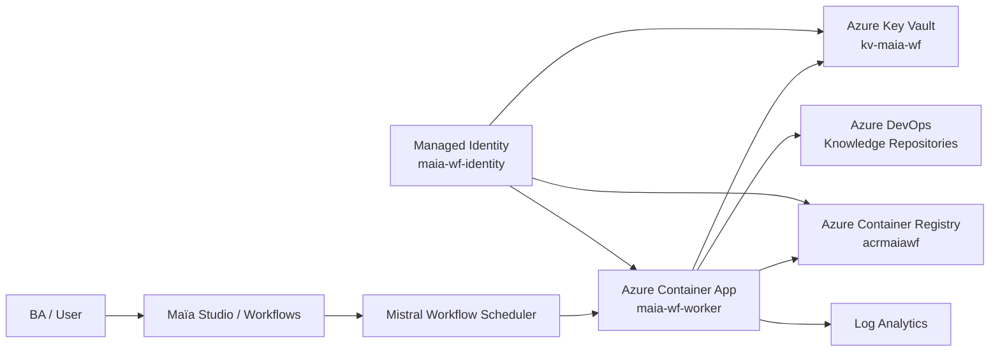

---

## 3. Current Scalability Problem

During BA testing, the current worker can crash when multiple users launch workflows concurrently.

Possible contributors:

- only one worker replica is effectively processing the workload;
- low resource allocation (`0.25 CPU / 0.5 Gi`);
- insufficient horizontal scaling;
- too many concurrent workflow or activity pollers for the allocated resources;
- memory pressure / OOM;
- application-level concurrency limits.

### Important principle

> Moving from Azure to GCP alone does not solve scalability.

The target design must include:

- multiple worker replicas;
- sufficient CPU and memory;
- controlled concurrency;
- horizontal scaling;
- load testing against realistic BA usage.

---

## 4. Target GCP Architecture

### Recommended GCP services

| Azure | GCP target |
|---|---|
| Azure Container Apps | **GKE Autopilot** |
| Azure Container Registry | Artifact Registry |
| Azure Key Vault | Secret Manager |
| User Assigned Managed Identity | GKE Workload Identity Federation + GCP Service Account |
| Log Analytics | Cloud Logging + Cloud Monitoring |
| ACA revisions | Kubernetes Deployment rollout / ReplicaSets |
| ACA scaling | Kubernetes replicas + HPA |
| Azure DevOps | Keep existing Azure DevOps |
| Maïa workflows | Keep existing Maïa workflows |

### Why GKE Autopilot

The Maïa / Mistral worker is a long-running background worker that continuously polls the workflow scheduler.

GKE is a better fit than a request-driven serverless runtime because it provides:

- long-running worker processes;
- stable replica management;
- native Kubernetes Deployment model;
- Horizontal Pod Autoscaler;
- controlled CPU / memory requests and limits;
- easier inspection with `kubectl`;
- clean support for multiple workers in the same deployment.

---

## 5. Target Architecture Diagram

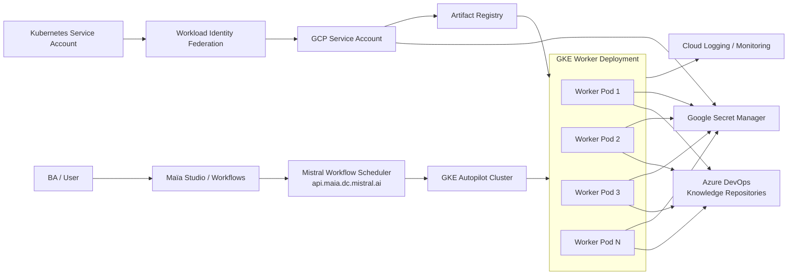

---

## 6. Identity and Authentication Model

### GCP runtime identity

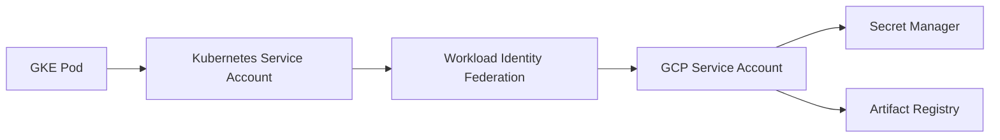

Recommended minimum GCP roles:

```text
Secret Manager Secret Accessor
Artifact Registry Reader
```

Avoid static GCP service account keys.

---

## 7. Azure DevOps Access After Migration

The GCP migration does **not** remove the requirement to access Azure DevOps.

The worker still needs to access:

```text
https://dev.azure.com/bis-org
```

Current application identity:

```text
App / Service Principal:
sp-ceva-app-ao_ai_dlc-prd

Required repo permissions:
Read
Contribute
Create branch
Contribute to pull requests
```

### Authentication flow

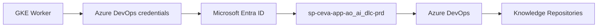

Initial migration recommendation:

- keep the existing Azure DevOps authentication mechanism;
- do not redesign Azure DevOps authentication during the first migration phase;
- reduce migration variables.

A later hardening phase can evaluate federation instead of storing `AZURE_CLIENT_SECRET`.

---

## 8. Maïa Workflow / Worker Relationship

The workflow definitions in Maïa do not need to be migrated.

The workers are execution agents connected to the Maïa workflow scheduler.

### Current

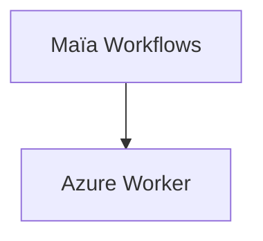

### Target

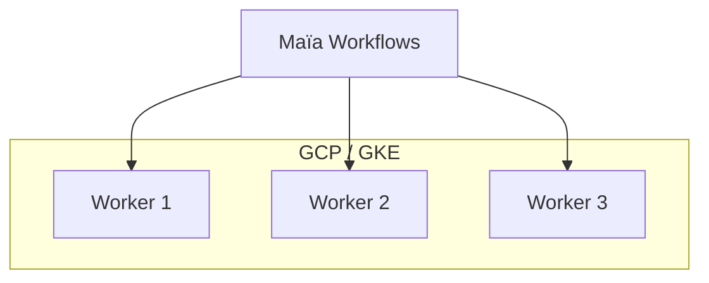

All workers participating in the same logical deployment should share the same:

```text
DEPLOYMENT_NAME
```

Example production value:

```text
DEPLOYMENT_NAME=ai-dlc-prod
```

---

# 9. Migration Phases

## Phase 0 — Baseline the current Azure problem

Before migration, capture the actual failure mode.

### Collect

```text
CPU usage
Memory usage
Container restarts
Exit codes
OOM events
Concurrent executions
Workflow duration
Queue latency
```

### Goal

Know the current crash threshold and use it as the migration acceptance baseline.

---

## Phase 1 — Prepare GCP foundation

Create or validate:

```text
GCP Project
VPC / network
GKE Autopilot cluster
Artifact Registry
Secret Manager
GCP Service Account
Cloud Logging
Cloud Monitoring
```

Suggested naming:

```text
Project:
ceva-ai-dlc-prod

Cluster:
gke-weu-ai-dlc-prd

Namespace:
maia-workflows

Artifact Registry:
maia-wf

Service Account:
maia-wf-worker
```

---

## Phase 2 — Move container image

Current image:

```text
acrmaiawf.azurecr.io/maia-wf-worker:117418
```

Target example:

```text
europe-westX-docker.pkg.dev/<project>/maia-wf/maia-wf-worker:117418
```

Migration rule:

Keep the **same application image/tag** for the first GCP test.

Do not combine cloud migration with an unrelated image/version change.

---

## Phase 3 — Move secrets

Current secrets:

```text
mistral-api-key
azure-devops-org-url
azure-tenant-id
azure-client-id
azure-client-secret
```

Create equivalent secrets in Secret Manager.

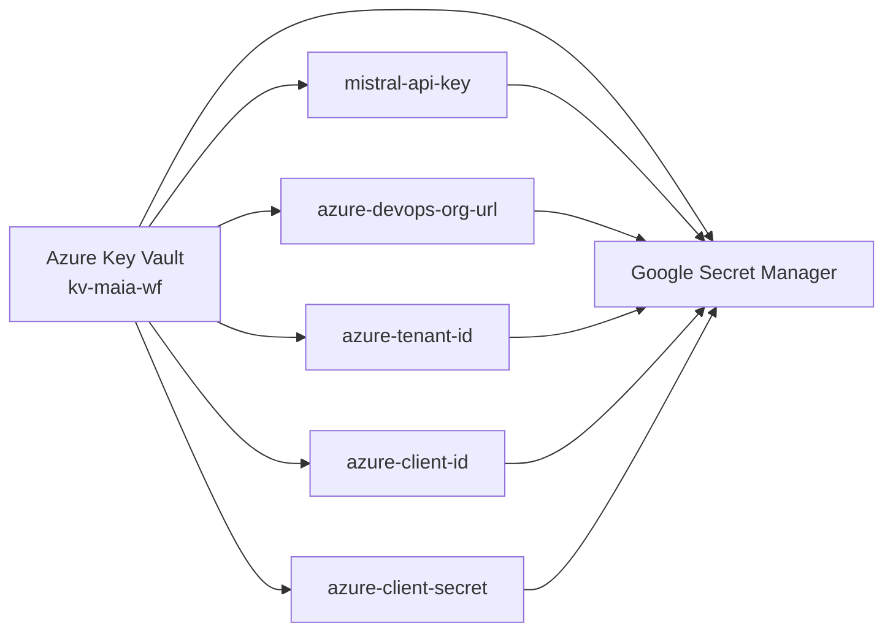

Security rule:

Never expose actual secret values in pipeline logs, shell history, Git, screenshots, or deployment output.

---

## Phase 4 — Configure GCP workload identity

Objective:

Allow pods to access Secret Manager without service account keys.

```text
GKE Pod
→ Kubernetes Service Account
→ Workload Identity Federation
→ GCP Service Account
→ Secret Manager
```

Minimum permissions:

```text
Secret Manager Secret Accessor
Artifact Registry Reader
```

---

## Phase 5 — Deploy GKE worker

Initial recommendation:

```text
replicas: 3
```

Initial resource baseline per pod:

```text
CPU request:    500m
CPU limit:      1
Memory request: 1Gi
Memory limit:   2Gi
```

Example deployment structure:

```yaml
apiVersion: apps/v1
kind: Deployment

metadata:
  name: maia-wf-worker

spec:
  replicas: 3

  selector:
    matchLabels:
      app: maia-wf-worker

  template:
    metadata:
      labels:
        app: maia-wf-worker

    spec:
      serviceAccountName: maia-wf-worker

      containers:
        - name: maia-wf-worker

          image: <artifact-registry>/maia-wf-worker:117418

          resources:
            requests:
              cpu: "500m"
              memory: "1Gi"

            limits:
              cpu: "1"
              memory: "2Gi"

          env:
            - name: SERVER_URL
              value: "https://api.maia.dc.mistral.ai"

            - name: DEPLOYMENT_NAME
              value: "ai-dlc-gcp-test"
```

---

## Phase 6 — Isolated GCP validation

Do not initially use the same production deployment name as Azure.

Example:

```text
Azure:
DEPLOYMENT_NAME=default

GCP test:
DEPLOYMENT_NAME=ai-dlc-gcp-test
```

Validation sequence:

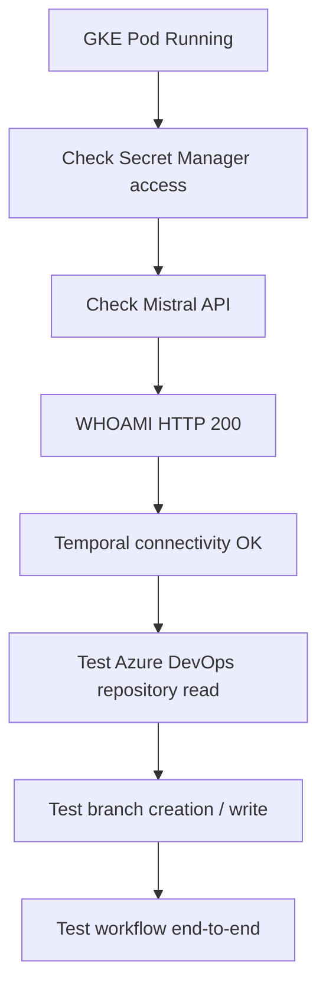

---

## Phase 7 — Runtime diagnostic

Inside the pod:

```bash
/app/.venv/bin/python -m mistralai.workflows.scripts.diagnose
```

Expected key output:

```text
MISTRAL_API_KEY: *** (set)
SERVER_URL: https://api.maia.dc.mistral.ai
```

```text
WHOAMI
======

[OK] Mistral API (...): HTTP 200
```

```text
CONNECTIVITY CHECKS
===================

[OK] Temporal (wf-scheduler.maia.dc.mistral.ai:443, tls=True)
```

Kubernetes equivalent:

```bash
kubectl exec -it <pod> -n maia-workflows -- \
  /app/.venv/bin/python \
  -m mistralai.workflows.scripts.diagnose
```

---

## Phase 8 — Functional validation

Validate each active workflow in Maïa, including examples currently visible:

```text
Knowledge Importer
Step 1 - Business requirement document
Step 2 - High level design
Step 3 - Backlog items
Ticket to Backlog Exporter
```

For each workflow, verify:

```text
Start
Execution
Knowledge repo read
Knowledge repo write
Branch creation
PR behavior
Completion
Error handling
```

---

## Phase 9 — Scalability / concurrency testing

The migration is only successful if the current BA concurrency issue is solved.

| Concurrent launches | Worker replicas | Expected |
|---:|---:|---|
| 1 | 3 | Pass |
| 5 | 3 | Pass |
| 10 | 3 | Pass / acceptable queue |
| 20 | 3–5 | Pass |
| 50 | autoscale / queue gracefully | No worker crash |

Metrics to collect:

```text
Workflow success rate
Workflow startup latency
p95 execution time
CPU utilization
Memory utilization
Pod restarts
OOMKilled
Task queue latency
Worker error count
```

Suggested acceptance:

```text
Worker crash = 0
OOMKilled = 0
Success rate > 99%
```

Latency targets should be agreed with BA / product based on real usage.

---

## Phase 10 — Add Horizontal Pod Autoscaler

Start with static replicas first. After collecting metrics, enable HPA.

```yaml
apiVersion: autoscaling/v2
kind: HorizontalPodAutoscaler

metadata:
  name: maia-wf-worker

spec:
  minReplicas: 3
  maxReplicas: 10

  scaleTargetRef:
    apiVersion: apps/v1
    kind: Deployment
    name: maia-wf-worker

  metrics:
    - type: Resource
      resource:
        name: cpu
        target:
          type: Utilization
          averageUtilization: 65
```

Scaling diagram:

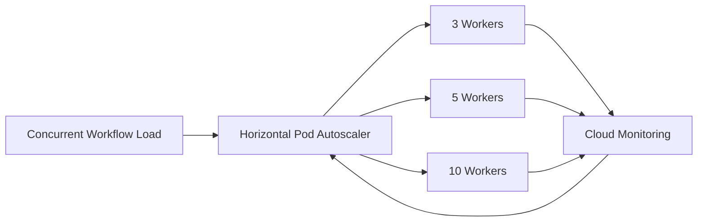

If CPU is not a good scaling signal, evaluate custom metrics later.

---

# 10. Cutover Strategy

Recommended approach: parallel migration.

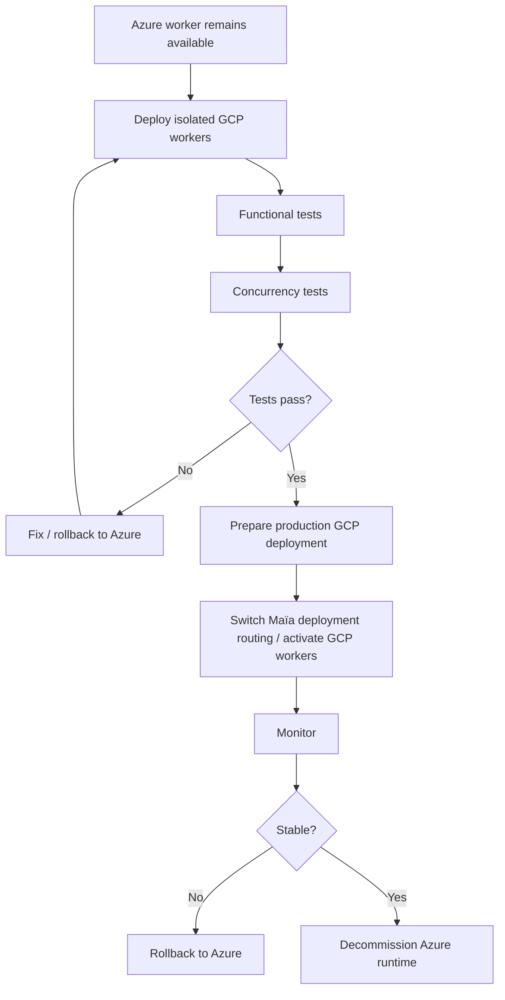

---

## 11. Cutover Checklist

```text
[ ] GKE worker deployment healthy
[ ] All pods Running / Ready
[ ] Secret Manager access OK
[ ] Mistral WHOAMI HTTP 200
[ ] Temporal connectivity OK
[ ] Azure DevOps read/write OK
[ ] All active workflows tested
[ ] Multi-user load test passed
[ ] HPA validated
[ ] Cloud Logging working
[ ] Alerts configured
[ ] Rollback procedure tested
```

---

# 12. Rollback Plan

Keep the Azure runtime available during the first production observation window.

Rollback steps:

```text
1. Stop / scale down GCP worker deployment.
2. Reactivate Azure worker deployment if required.
3. Restore original Maïa deployment routing.
4. Verify Mistral WHOAMI and Temporal connectivity.
5. Run one functional workflow test.
```

Do not delete Azure Container App, Key Vault, ACR, or Managed Identity until the agreed stability window is completed.

---

# 13. Observability

Track:

```text
Pod CPU
Pod memory
Pod restarts
OOMKilled
Replica count
Workflow errors
Mistral API errors
Temporal connectivity errors
Azure DevOps errors
```

Suggested alerts:

```text
Pod restart > threshold
OOMKilled > 0
Worker replica unavailable
Mistral 401 / 403 / 5xx
Temporal connection failure
Azure DevOps 401 / 403
High CPU > 80%
High memory > 85%
```

---

# 14. End-to-End Target Flow

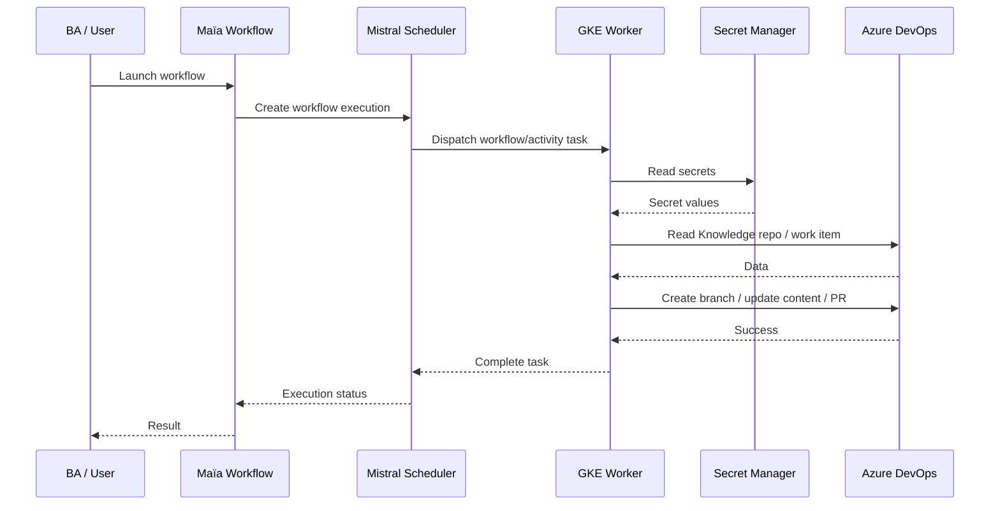

---

# 15. Responsibility Matrix

| Area | Likely owner |
|---|---|
| GCP project / network | Cloud / Infra |
| GKE cluster | Platform / DevOps |
| Artifact Registry | Platform / DevOps |
| Secret Manager | Platform / Security |
| GCP IAM / WIF | Cloud / Security |
| Maïa workflow config | AI-DLC / Maïa team |
| Worker image | Development / AI-DLC |
| Azure DevOps repo permissions | Azure DevOps / Project admins |
| Load test | BA + QA + AI-DLC |
| Monitoring / alerts | Platform / Operations |

---

# 16. Recommended Delivery Order

```text
P0
1. Baseline current Azure crash
2. GCP foundation
3. Artifact Registry
4. Secret Manager
5. Workload Identity
6. Deploy 3 GKE workers
7. Mistral diagnose
8. ADO access test
9. Workflow functional test

P1
10. Concurrency testing
11. Resource tuning
12. HPA
13. Monitoring / alerts

P2
14. Production cutover
15. Observation window
16. Azure decommission
```

---

# 17. Final Recommendation

Recommended target:

```text
GKE Autopilot
3 initial worker replicas
same worker image
same Maïa endpoint
same Azure DevOps integration
Secret Manager
Workload Identity Federation
Cloud Logging / Monitoring
HPA after load-test calibration
```

The migration should be treated as a **scalability and runtime architecture change**, not only a cloud provider move.

The key success criterion is:

> Multiple BAs can launch workflows concurrently without worker crashes, while maintaining stable workflow execution, repository access, and acceptable latency.
