# GCP Fundamentals for Azure-to-GCP Migration — Maïa Worker / AI-DLC

> Mục tiêu: giúp Technical Advisor đang quen Azure có đủ kiến thức nền GCP để đọc architecture, review migration plan, hỏi đúng câu hỏi với Cloud/DevOps team, troubleshoot cơ bản và kiểm soát migration `maia-wf-worker` từ Azure Container Apps sang GCP.
>
> Phạm vi ưu tiên: **Resource hierarchy → IAM → Networking → GKE → Artifact Registry → Secret Manager → Workload Identity → Logging/Monitoring → gcloud/kubectl → Migration & Troubleshooting**.

---

# 1. Mental model: Azure và GCP khác nhau thế nào?

Nếu đang quen Azure, có thể map nhanh như sau:

| Azure | GCP | Ý nghĩa |
|---|---|---|
| Tenant / Entra ID | Google Cloud Organization + Cloud Identity / IAM | Identity + organization boundary |
| Management Group | Folder | Nhóm nhiều projects |
| Subscription | Project (gần nhất về operational boundary) | Billing/API/IAM/resource boundary |
| Resource Group | Không có equivalent 1:1 | GCP resources chủ yếu nằm trực tiếp trong Project |
| Azure RBAC | IAM | Phân quyền |
| Service Principal | Service Account / external federated identity | Machine identity |
| Managed Identity | Workload Identity / Service Account | Workload auth không cần static key |
| VNet | VPC | Network |
| Subnet | Subnet | IP range |
| NSG | VPC firewall policy/rules | Network filtering |
| Private Endpoint | Private Service Connect / private access patterns | Private service connectivity |
| Azure Container Apps | Cloud Run hoặc GKE tùy workload | Container runtime |
| AKS | GKE | Managed Kubernetes |
| ACR | Artifact Registry | Container/package registry |
| Key Vault | Secret Manager + Cloud KMS | Secrets / keys |
| Log Analytics | Cloud Logging | Central logs |
| Azure Monitor | Cloud Monitoring | Metrics / alerts |
| Azure CLI `az` | `gcloud` | CLI |
| Azure DevOps | Có thể giữ nguyên | Source/pipeline không bắt buộc migrate |

**Quan trọng:** GCP không có Resource Group giống Azure. `Project` là boundary rất quan trọng cho IAM, billing, API enablement và quota.

---

# 2. GCP Resource Hierarchy

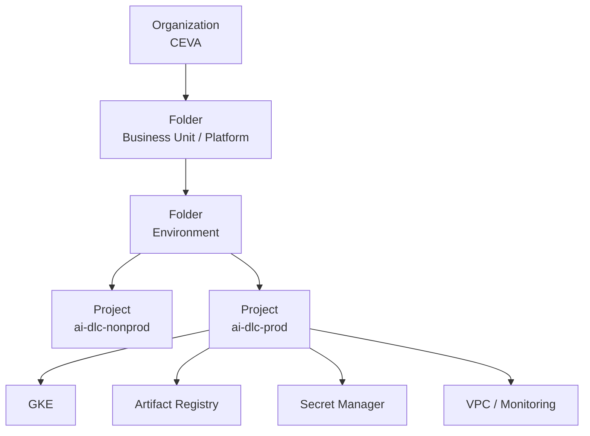

## 2.1 Organization

Top-level resource đại diện cho enterprise.

IAM policy đặt ở Organization có thể được inherit xuống Folder, Project và resources.

## 2.2 Folder

Dùng để nhóm projects theo:

```text
Business Unit
Environment
Region
Platform
Security zone
```

Ví dụ:

```text
CEVA
└── AI Platform
    ├── NonProd
    │   └── ai-dlc-np
    └── Prod
        └── ai-dlc-prd
```

## 2.3 Project

Project là đơn vị quan trọng nhất cần nhớ.

Project chứa:

```text
GKE
Artifact Registry
Secret Manager
VPC resources
Service Accounts
Logging
Monitoring
APIs
Quotas
```

Project cũng có:

```text
Project ID
Project Number
Project Name
```

Ví dụ:

```text
Project Name   : AI DLC Production
Project ID     : ceva-ai-dlc-prd
Project Number : 123456789012
```

Trong CLI và IAM thường gặp **Project ID** và **Project Number** nhiều hơn display name.

---

# 3. APIs / Services — điểm rất khác Azure

Nhiều GCP service phải được **enable API** trước khi dùng.

Ví dụ:

```bash
gcloud services enable \
  container.googleapis.com \
  artifactregistry.googleapis.com \
  secretmanager.googleapis.com \
  logging.googleapis.com \
  monitoring.googleapis.com
```

Nếu quên enable API, lỗi thường kiểu:

```text
API has not been used in project...
API is disabled
SERVICE_DISABLED
```

Mental model:

```text
Project
  ↓
API enabled?
  ↓
IAM permission?
  ↓
Resource exists?
```

---

# 4. IAM — phần quan trọng nhất

## 4.1 IAM gồm 3 thành phần

```text
Principal + Role + Resource
```

Ví dụ:

```text
Principal:
maia-wf-worker@ceva-ai-dlc-prd.iam.gserviceaccount.com

Role:
roles/secretmanager.secretAccessor

Resource:
secret mistral-api-key
```

## 4.2 Principal có thể là

```text
User
Group
Service Account
Workload Identity principal
External identity
```

## 4.3 Role

GCP có:

```text
Basic roles
Predefined roles
Custom roles
```

Production nên ưu tiên predefined/custom roles, tránh role quá rộng.

Ví dụ:

```text
roles/viewer
roles/container.developer
roles/artifactregistry.reader
roles/secretmanager.secretAccessor
```

---

# 5. IAM inheritance

IAM có inheritance từ:

```text
Organization
  ↓
Folder
  ↓
Project
  ↓
Resource
```

Ví dụ:

```text
roles/viewer
granted at Project
```

=> principal có thể đọc nhiều resources trong project.

Nếu chỉ muốn đọc 1 secret:

```text
grant Secret Accessor
at Secret level
```

thay vì entire Project.

### Khi troubleshoot permission

Luôn hỏi:

```text
Who?
Role nào?
Scope nào?
Inherited từ đâu?
Có Deny policy không?
```

---

# 6. Service Account

Service Account là machine identity rất thường gặp trong GCP.

Ví dụ:

```text
maia-wf-worker@ceva-ai-dlc-prd.iam.gserviceaccount.com
```

Nó tương đương gần nhất với:

```text
Azure Service Principal / Managed Identity
```

Service Account có thể được grant IAM roles để access:

```text
Secret Manager
Artifact Registry
Cloud Storage
Pub/Sub
BigQuery
GKE-related APIs
```

## Production rule

Không nên tạo JSON key nếu không cần.

Ưu tiên:

```text
Workload Identity Federation
```

---

# 7. Workload Identity Federation for GKE

Đây là phần rất quan trọng khi migrate `maia-wf-worker`.

Target flow:

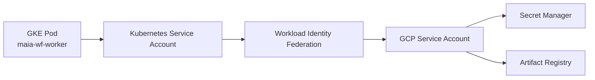

Mục tiêu:

```text
Pod
→ authenticate tới Google Cloud
→ không cần service-account JSON key
```

GKE Autopilot bật Workload Identity Federation for GKE theo thiết kế platform.

---

# 8. Kubernetes Service Account vs GCP Service Account

Đừng nhầm 2 loại này.

| Thành phần | Scope | Ví dụ |
|---|---|---|
| Kubernetes Service Account (KSA) | Kubernetes | `maia-wf-worker` trong namespace |
| GCP Service Account (GSA) | Google Cloud IAM | `maia-wf-worker@project.iam.gserviceaccount.com` |

Flow:

```text
KSA
↓ Workload Identity
GSA
↓ IAM
Secret Manager / GCP APIs
```

---

# 9. VPC — network core

Azure:

```text
VNet
```

GCP:

```text
VPC
```

Điểm rất đáng nhớ:

**GCP VPC là global resource**, còn subnet là regional.

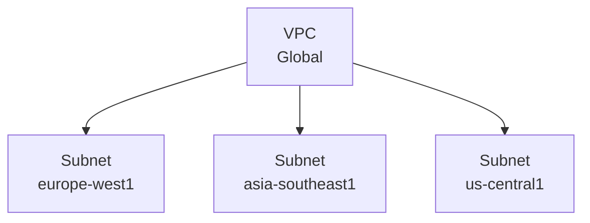

---

# 10. Subnet

Subnet thuộc region và có CIDR.

Ví dụ:

```text
10.20.0.0/20
```

Khi deploy GKE cần hiểu:

```text
Node IP range
Pod IP range
Service IP range
```

Trong VPC-native GKE, secondary IP ranges thường được dùng cho Pods và Services.

Mental model:

```text
VPC
 ↓
Subnet
 ├── Nodes
 ├── Pod secondary range
 └── Service secondary range
```

---

# 11. Firewall

GCP firewall thường áp dụng dựa trên:

```text
direction
source/destination
protocol
port
target identity/tag
priority
```

Ví dụ cần outbound:

```text
GKE worker
→ api.maia.dc.mistral.ai:443

GKE worker
→ dev.azure.com:443
```

Troubleshoot:

```text
DNS
→ route
→ firewall
→ TCP 443
→ TLS
→ HTTP
```

Mental model vẫn giống network troubleshooting trên Azure.

---

# 12. Cloud NAT

Nếu GKE private nodes/pods cần outbound Internet mà không có public IP, thường cần:

```text
Cloud NAT
```

Flow:

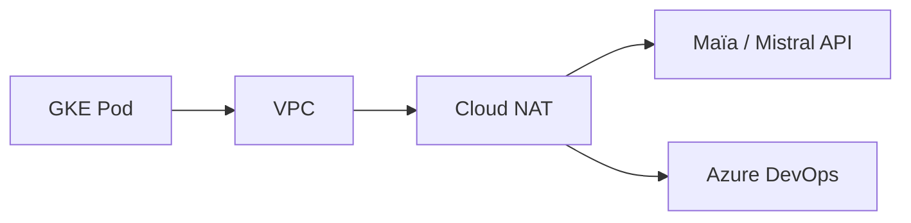

Đây là thành phần cần hỏi Cloud team ngay vì worker phải outbound tới:

```text
api.maia.dc.mistral.ai:443
dev.azure.com:443
login.microsoftonline.com:443
```

nếu Azure DevOps auth vẫn dùng Entra ID.

---

# 13. DNS

GCP có Cloud DNS.

Cần phân biệt:

```text
public DNS
private DNS zone
corporate DNS
hybrid DNS
```

Trong GKE pod:

```bash
nslookup api.maia.dc.mistral.ai
```

hoặc:

```bash
getent hosts api.maia.dc.mistral.ai
```

Nếu DNS fail:

```text
chưa debug Mistral API key
```

---

# 14. GKE — Kubernetes Engine

GKE = Google Kubernetes Engine.

Tương đương:

```text
AKS
```

Có hai model chính:

```text
GKE Standard
GKE Autopilot
```

---

# 15. GKE Autopilot

Google quản lý nhiều phần infrastructure hơn.

Bạn tập trung vào:

```text
Deployment
Pod
Service
ConfigMap
Secret integration
CPU / Memory
HPA
PDB
Logging
```

Thay vì:

```text
VM/node administration
node pool sizing chi tiết
OS maintenance
```

Phù hợp nếu team muốn Kubernetes nhưng không muốn quản node quá sâu.

---

# 16. GKE Standard

Cho nhiều control hơn:

```text
Node pools
Machine types
Taints
Labels
GPU
Node image
Upgrade strategy
Special workloads
```

Nhưng operational overhead cao hơn.

### Recommendation cho Maïa worker

Start:

```text
GKE Autopilot
```

Chỉ chuyển Standard nếu có requirement thật sự về node/runtime.

---

# 17. Kubernetes objects cần nắm

Cho migration này, ưu tiên học:

```text
Namespace
Pod
Deployment
ReplicaSet
ServiceAccount
ConfigMap
Secret
HorizontalPodAutoscaler
PodDisruptionBudget
Job / CronJob
```

Không cần học toàn Kubernetes trước khi bắt đầu.

---

# 18. Pod

Pod là execution unit nhỏ nhất.

Trong case Maïa:

```text
1 Pod
≈ 1 running maia-wf-worker container
```

Ví dụ:

```text
maia-wf-worker-7464b4d8fc-abc12
```

Check:

```bash
kubectl get pods -n maia-workflows
```

---

# 19. Deployment

Deployment quản nhiều identical worker pods.

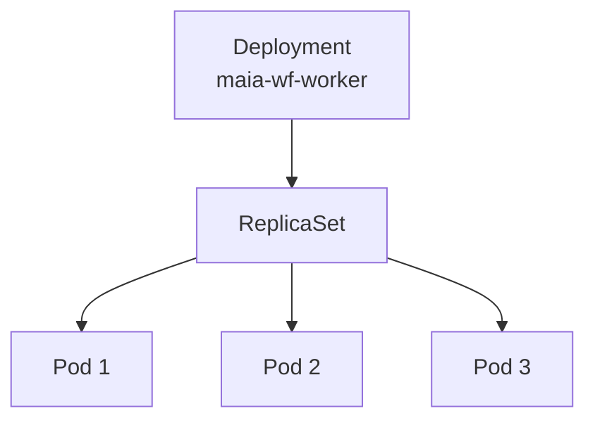

Ví dụ:

```yaml
spec:
  replicas: 3
```

=> target 3 Maïa workers.

---

# 20. ReplicaSet

Deployment tạo ReplicaSet.

Bạn hiếm khi chỉnh ReplicaSet trực tiếp.

Flow:

```text
Deployment
→ ReplicaSet
→ Pods
```

Khi update image/config:

```text
Deployment
→ new ReplicaSet
→ new Pods
→ old ReplicaSet scale down
```

Equivalent gần nhất với ACA revision rollout.

---

# 21. Namespace

Dùng để tách logical workloads.

Ví dụ:

```text
maia-workflows
```

Commands:

```bash
kubectl get pods -n maia-workflows
kubectl get deployment -n maia-workflows
```

---

# 22. Resource requests và limits

Rất quan trọng cho issue scalability.

Ví dụ:

```yaml
resources:
  requests:
    cpu: "500m"
    memory: "1Gi"
  limits:
    cpu: "1"
    memory: "2Gi"
```

Ý nghĩa:

```text
requests
→ resource scheduler dùng để guarantee/schedule

limits
→ maximum container được phép dùng
```

Current Azure baseline từng là:

```text
0.25 CPU
0.5 Gi
```

Initial GKE baseline nên load-test với mức lớn hơn thay vì copy nguyên cấu hình nhỏ này.

---

# 23. Horizontal Pod Autoscaler — HPA

HPA tự thay đổi replica count.

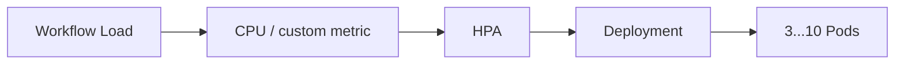

Ví dụ:

```text
minReplicas = 3
maxReplicas = 10
CPU target = 65%
```

Nhưng với Maïa worker, CPU có thể chưa phải metric tốt nhất.

Sau này có thể evaluate:

```text
task queue latency
pending tasks
running workflows
active activities
```

---

# 24. PodDisruptionBudget — PDB

Dùng để tránh planned disruption làm mất quá nhiều worker cùng lúc.

Ví dụ:

```yaml
spec:
  minAvailable: 2
```

Nếu có 3–5 workers:

```text
maintenance
node upgrade
voluntary eviction
```

thì Kubernetes cố giữ ít nhất số pod available theo policy trong các disruption được PDB kiểm soát.

PDB **không cứu** pod khỏi application crash/OOM.

---

# 25. Probes

Các probe cần biết:

```text
startupProbe
readinessProbe
livenessProbe
```

### startupProbe

App có start xong chưa?

### readinessProbe

Pod có sẵn sàng nhận workload không?

### livenessProbe

Process có bị stuck/dead không?

Với background worker, cần thiết kế health endpoint hoặc command-based health check phù hợp. Không copy HTTP probe từ web API nếu worker không expose HTTP endpoint.

---

# 26. Artifact Registry

Equivalent:

```text
Azure Container Registry
→ Artifact Registry
```

Current:

```text
acrmaiawf.azurecr.io/maia-wf-worker:117418
```

Target:

```text
REGION-docker.pkg.dev/PROJECT/REPOSITORY/maia-wf-worker:117418
```

Ví dụ:

```text
europe-west1-docker.pkg.dev/ceva-ai-dlc-prd/maia-wf/maia-wf-worker:117418
```

---

# 27. Artifact Registry concepts

Hierarchy:

```text
Project
 ↓
Repository
 ↓
Package/Image
 ↓
Version/Tag
```

Ví dụ:

```text
ceva-ai-dlc-prd
└── maia-wf
    └── maia-wf-worker
        ├── 117418
        └── 117500
```

Common IAM:

```text
Artifact Registry Reader
Artifact Registry Writer
```

Runtime chỉ pull:

```text
Reader
```

CI/CD push image:

```text
Writer
```

---

# 28. Secret Manager

Equivalent gần nhất:

```text
Azure Key Vault secrets
→ Secret Manager
```

Current secrets:

```text
mistral-api-key
azure-devops-org-url
azure-tenant-id
azure-client-id
azure-client-secret
```

Secret Manager model:

```text
Secret
 ├── Version 1
 ├── Version 2
 └── Version N
```

IAM có thể grant ở:

```text
Project
hoặc
individual Secret
```

Runtime recommended:

```text
roles/secretmanager.secretAccessor
```

---

# 29. Secret Manager access flow cho Maïa

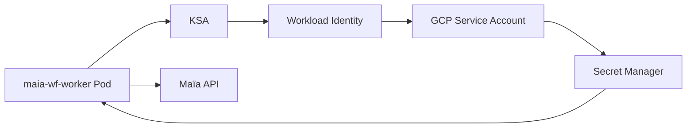

Production principle:

```text
Pod không cần biết service-account private key.
```

---

# 30. ConfigMap vs Secret

Không phải config nào cũng cần Secret Manager.

Ví dụ:

```text
SERVER_URL=https://api.maia.dc.mistral.ai
DEPLOYMENT_NAME=ai-dlc-prod
```

không phải secret.

Có thể dùng:

```text
ConfigMap
hoặc Deployment env
```

Còn:

```text
MISTRAL_API_KEY
AZURE_CLIENT_SECRET
```

phải là secret.

---

# 31. Cloud Logging

Equivalent:

```text
Log Analytics
→ Cloud Logging
```

GKE container stdout/stderr thường được collect vào Cloud Logging nếu cluster logging được enable/config đúng.

Useful queries cần học:

```text
resource.type="k8s_container"
resource.labels.namespace_name="maia-workflows"
```

Concepts:

```text
Log Explorer
Logs
Log-based metrics
Sinks
Retention
```

---

# 32. Cloud Monitoring

Equivalent:

```text
Azure Monitor
→ Cloud Monitoring
```

Theo dõi:

```text
CPU
Memory
Pod count
Restart count
Availability
Custom metrics
Alert policies
Dashboards
```

Với Maïa:

```text
Worker replicas
OOMKilled
CPU/memory
Mistral HTTP errors
Temporal errors
Azure DevOps errors
Workflow latency
```

---

# 33. Observability relationship

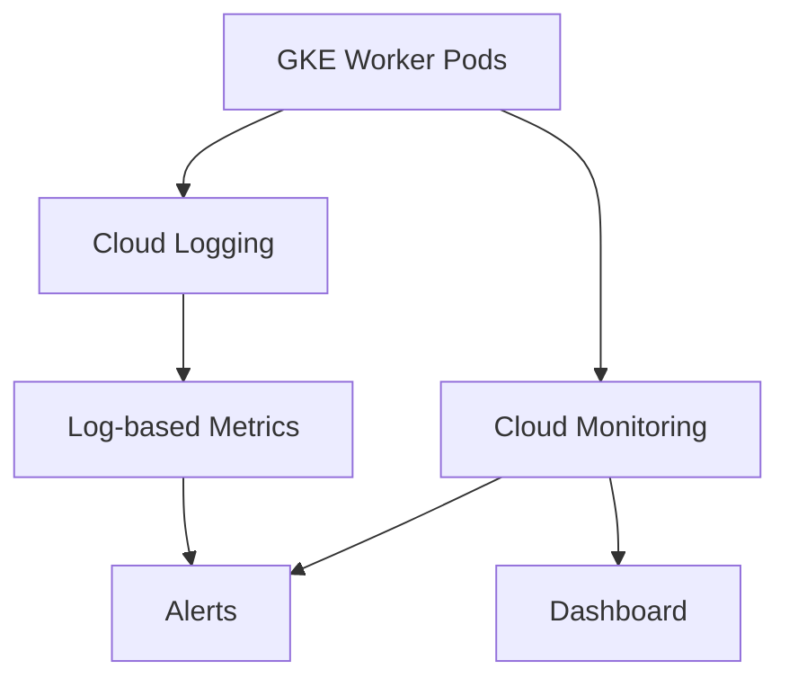

---

# 34. gcloud CLI

Equivalent:

```text
az
→ gcloud
```

Basic commands:

```bash
gcloud auth list
gcloud config list
gcloud projects list
gcloud config get-value project
```

Set project:

```bash
gcloud config set project ceva-ai-dlc-prd
```

---

# 35. Check GCP identity/context

```bash
gcloud auth list
```

Representative:

```text
Credentialed Accounts
ACTIVE  ACCOUNT
*       user@company.com
```

Check project:

```bash
gcloud config get-value project
```

Expected:

```text
ceva-ai-dlc-prd
```

Rule giống Azure:

```text
Trước khi troubleshoot
→ verify account + project
```

---

# 36. List enabled APIs

```bash
gcloud services list --enabled
```

Check specific API:

```bash
gcloud services list --enabled \
  --filter="NAME:container.googleapis.com"
```

---

# 37. GKE CLI context

Get cluster credentials:

```bash
gcloud container clusters get-credentials <cluster> \
  --region <region> \
  --project <project>
```

Sau đó:

```bash
kubectl config current-context
kubectl get nodes
kubectl get pods -A
```

---

# 38. Kubernetes commands quan trọng nhất

```bash
kubectl get pods -n maia-workflows -o wide

kubectl get deployment -n maia-workflows

kubectl describe pod <pod> -n maia-workflows

kubectl logs <pod> -n maia-workflows

kubectl logs -f <pod> -n maia-workflows

kubectl logs <pod> -n maia-workflows --previous

kubectl exec -it <pod> -n maia-workflows -- /bin/sh
```

---

# 39. Run Mistral diagnose trên GKE

Equivalent ACA command:

```text
az containerapp exec ...
```

GKE:

```bash
kubectl exec -it <pod> -n maia-workflows -- \
  /app/.venv/bin/python \
  -m mistralai.workflows.scripts.diagnose
```

Expected key output:

```text
MISTRAL_API_KEY: *** (set)
SERVER_URL: https://api.maia.dc.mistral.ai

WHOAMI
[OK] Mistral API: HTTP 200

CONNECTIVITY CHECKS
[OK] Temporal (...)
```

---

# 40. Troubleshoot GKE Pod

Mental flow:

```text
Pod Pending?
→ scheduler/resources/IAM/node

ImagePullBackOff?
→ Artifact Registry / image name / IAM

CrashLoopBackOff?
→ application startup

OOMKilled?
→ memory limit

Running but workflow fail?
→ env/secrets/network/Mistral/ADO
```

---

# 41. Common Pod status

| Status | Ý nghĩa thường gặp |
|---|---|
| Pending | Không schedule được |
| ContainerCreating | Đang setup |
| Running | Container đang chạy |
| CrashLoopBackOff | App start rồi crash lặp lại |
| ImagePullBackOff | Pull image fail |
| ErrImagePull | Registry/image/IAM issue |
| OOMKilled | Hết memory |
| Completed | Process exit 0 |

---

# 42. Debug ImagePullBackOff

Check:

```bash
kubectl describe pod <pod> -n maia-workflows
```

Look for:

```text
Failed to pull image
403
Permission denied
Not found
```

Then check:

```text
Artifact Registry repo
image/tag
Service Account
Artifact Registry Reader role
```

---

# 43. Debug secret access

Symptoms:

```text
403 PermissionDenied
Secret not found
Application env missing
```

Check:

```text
Secret exists?
Secret version enabled?
KSA/GSA mapping?
secretAccessor role?
Correct project?
```

---

# 44. Debug outbound connectivity

From pod:

```bash
kubectl exec -it <pod> -n maia-workflows -- /bin/sh
```

Then:

```bash
nslookup api.maia.dc.mistral.ai
```

```bash
curl -vk https://api.maia.dc.mistral.ai
```

```bash
curl -I https://dev.azure.com
```

Investigation:

```text
DNS
→ VPC route
→ firewall
→ Cloud NAT
→ TLS
→ application auth
```

---

# 45. Azure DevOps remains an external dependency

Migration flow:

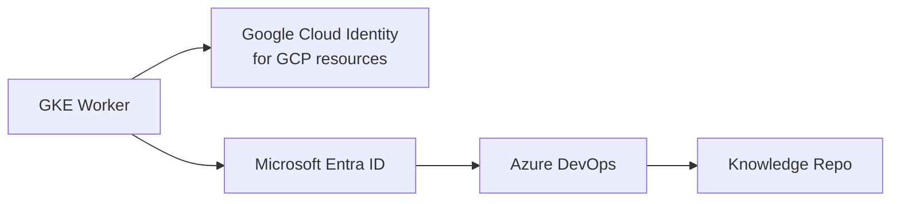

Có **2 identity domains**:

```text
GCP identity
→ access GCP resources

Microsoft identity
→ access Azure DevOps
```

Đừng trộn hai thứ này.

---

# 46. Deployment rollout

Khi update:

```text
image
env
resources
labels
config
```

Deployment tạo rollout mới.

Useful:

```bash
kubectl rollout status deployment/maia-wf-worker \
  -n maia-workflows
```

History:

```bash
kubectl rollout history deployment/maia-wf-worker \
  -n maia-workflows
```

Rollback:

```bash
kubectl rollout undo deployment/maia-wf-worker \
  -n maia-workflows
```

---

# 47. Scaling manually

```bash
kubectl scale deployment maia-wf-worker \
  --replicas=3 \
  -n maia-workflows
```

Verify:

```bash
kubectl get pods -n maia-workflows
```

---

# 48. HPA troubleshooting

```bash
kubectl get hpa -n maia-workflows
```

```bash
kubectl describe hpa maia-wf-worker \
  -n maia-workflows
```

Check:

```text
current replicas
desired replicas
current metric
target metric
scaling events
```

---

# 49. GCP quotas

GCP có quotas theo project/region/service.

Có thể fail dù IAM đúng.

Ví dụ:

```text
CPU quota
IP quota
API quota
GKE resource quota
```

Symptoms:

```text
RESOURCE_EXHAUSTED
Quota exceeded
```

Khi migration cần check quota trước load test.

---

# 50. Billing / Cost

Các thành phần có cost cần monitor:

```text
GKE Autopilot compute
Artifact Registry storage/egress
Secret Manager operations
Cloud Logging ingestion/retention
Cloud Monitoring custom metrics
Cloud NAT
Network egress
```

Đặc biệt:

```text
GCP → Azure DevOps
GCP → Maïa endpoint
```

có thể tạo external network egress tùy topology.

---

# 51. Region

GCP services thường cần chọn region.

Cần hỏi:

```text
GKE region?
Artifact Registry region?
Secret replication strategy?
Data residency?
Latency tới Maïa?
Latency tới Azure DevOps?
Corporate connectivity?
```

Không chọn region chỉ theo tên `weu` từ Azure.

---

# 52. Shared VPC

Enterprise GCP thường dùng Shared VPC.

Mental model:

```text
Host Project
→ owns VPC

Service Project
→ owns GKE/application resources
→ consumes Shared VPC
```

Nếu CEVA dùng Shared VPC, bạn có thể không thấy VPC được tạo trực tiếp trong project AI-DLC.

Đây là câu cần hỏi Cloud team:

```text
Is this project using Shared VPC?
Which host project owns the subnet?
```

---

# 53. Private GKE

Production cluster có thể private.

Khi đó cần quan tâm:

```text
Private control plane access
Private nodes
Cloud NAT
DNS
Firewall
Authorized networks
Corporate access path
```

Nếu local laptop không chạy được `kubectl`, chưa chắc cluster lỗi; có thể control plane private.

---

# 54. Load Balancer / Ingress — có cần không?

Maïa worker hiện là **outbound background worker**.

Nếu worker không expose public API thì thường **không cần**:

```text
Ingress
External Load Balancer
Public Service
```

Flow chính:

```text
Worker
→ outbound
→ Mistral / Azure DevOps
```

Đây giúp giảm attack surface.

---

# 55. Cloud Run — khi nào dùng?

Cloud Run hợp hơn cho:

```text
HTTP request-driven service
stateless API
event-driven request handling
scale-to-zero use case
```

Maïa worker là:

```text
long-running
polling
background process
```

nên GKE thường cho control tốt hơn.

Tuy nhiên đây là architecture decision, không phải Cloud Run "không chạy được".

---

# 56. Terraform / Infrastructure as Code

Migration production nên tránh click Portal/Console quá nhiều.

Ưu tiên IaC:

```text
Terraform
```

Resources nên codify:

```text
GKE
Artifact Registry
Secret Manager metadata
IAM
Service Accounts
Networking
Monitoring
```

Không commit secret values vào Terraform code/state output.

---

# 57. CI/CD từ Azure DevOps tới GCP

Có thể giữ Azure DevOps pipeline.

Target:

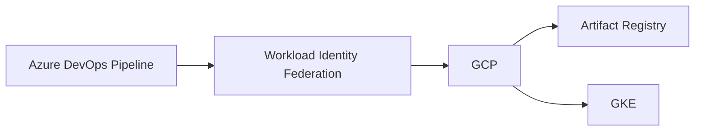

Production nên ưu tiên federation thay vì GCP Service Account JSON key.

---

# 58. Migration control checklist cho TA

## Foundation

```text
[ ] Correct GCP Organization / Folder / Project
[ ] Billing attached
[ ] Required APIs enabled
[ ] Region approved
[ ] Quotas checked
```

## Network

```text
[ ] VPC / Shared VPC identified
[ ] GKE subnet identified
[ ] Pod / Service ranges known
[ ] DNS works
[ ] Cloud NAT available if required
[ ] Outbound 443 to Maïa works
[ ] Outbound 443 to Azure DevOps works
[ ] Outbound to Entra login endpoints works
```

## Identity

```text
[ ] GCP Service Account exists
[ ] Kubernetes Service Account exists
[ ] Workload Identity mapping configured
[ ] Secret Manager permission minimal
[ ] Artifact Registry permission minimal
[ ] No static GCP key unless explicitly approved
```

## Runtime

```text
[ ] GKE cluster healthy
[ ] Namespace exists
[ ] Deployment exists
[ ] 3 initial replicas
[ ] CPU/memory defined
[ ] Restart behavior understood
[ ] PDB considered
[ ] HPA planned
```

## Application

```text
[ ] Same image initially
[ ] SERVER_URL correct
[ ] MISTRAL_API_KEY available
[ ] DEPLOYMENT_NAME correct
[ ] Azure DevOps auth works
[ ] Knowledge repos accessible
```

## Diagnostics

```text
[ ] Pod Running
[ ] Mistral diagnose WHOAMI HTTP 200
[ ] Temporal connectivity OK
[ ] No CrashLoopBackOff
[ ] No OOMKilled
[ ] Logs visible in Cloud Logging
[ ] Metrics visible in Cloud Monitoring
```

## Scalability

```text
[ ] 1 user test
[ ] 5 concurrent users
[ ] 10 concurrent users
[ ] 20 concurrent users
[ ] No worker crash
[ ] No OOM
[ ] HPA behavior validated
```

---

# 59. Azure → GCP troubleshooting mapping

| Azure command/concept | GCP/Kubernetes equivalent |
|---|---|
| `az account show` | `gcloud config list`, `gcloud auth list` |
| `az account set` | `gcloud config set project` |
| ACA show | `kubectl get/describe deployment,pod` |
| ACA revisions | Deployment ReplicaSets / rollout history |
| ACA logs | `kubectl logs` + Cloud Logging |
| ACA exec | `kubectl exec` |
| Managed Identity | Workload Identity + Service Account |
| Key Vault IAM | Secret Manager IAM |
| ACR | Artifact Registry |
| Log Analytics | Cloud Logging |
| Azure Monitor | Cloud Monitoring |
| VNet | VPC |
| UDR | VPC routes |
| NSG | Firewall rules/policies |
| Azure NAT Gateway | Cloud NAT |
| AKS | GKE |

---

# 60. Commands nên nhớ đầu tiên

```bash
# Context
gcloud auth list
gcloud config get-value project
gcloud config set project <project-id>

# APIs
gcloud services list --enabled

# GKE
gcloud container clusters list

gcloud container clusters get-credentials <cluster> \
  --region <region>

# Kubernetes
kubectl config current-context
kubectl get nodes
kubectl get pods -A
kubectl get pods -n maia-workflows
kubectl describe pod <pod> -n maia-workflows
kubectl logs <pod> -n maia-workflows
kubectl logs <pod> -n maia-workflows --previous
kubectl exec -it <pod> -n maia-workflows -- /bin/sh

# Deployment
kubectl get deployment -n maia-workflows
kubectl rollout status deployment/maia-wf-worker -n maia-workflows
kubectl rollout history deployment/maia-wf-worker -n maia-workflows

# Scaling
kubectl get hpa -n maia-workflows
kubectl get pdb -n maia-workflows
```

---

# 61. Recommended learning order — 7 ngày

## Day 1 — GCP hierarchy + IAM

Học:

```text
Organization
Folder
Project
IAM
Service Account
role/scope/inheritance
```

Mục tiêu:

> Nhìn permission issue và biết identity nào có quyền ở đâu.

## Day 2 — VPC / subnet / firewall / NAT / DNS

Mục tiêu:

> Biết worker ra Internet/Maïa/Azure DevOps bằng đường nào.

## Day 3 — GKE fundamentals

Học:

```text
Pod
Deployment
ReplicaSet
Namespace
ServiceAccount
kubectl
```

## Day 4 — Secrets + Artifact Registry + Workload Identity

Mục tiêu:

> Biết image và secrets vào Pod bằng cách nào mà không dùng static credentials.

## Day 5 — Scaling

Học:

```text
requests/limits
HPA
PDB
probes
OOMKilled
CrashLoopBackOff
```

## Day 6 — Logging / Monitoring

Mục tiêu:

> Khi BA nói workflow crash, tìm được Pod, log, restart, CPU/memory và nguyên nhân.

## Day 7 — End-to-end migration lab

Trace:

```text
Maïa
→ Scheduler
→ GKE worker
→ Secret Manager
→ Azure DevOps
→ Knowledge repo
→ response
```

---

# 62. Những câu TA nên hỏi GCP/Cloud team

```text
Which GCP project will host the Maïa workers?

Are we using Shared VPC?

Which region and subnet will GKE use?

Will the GKE cluster be Autopilot or Standard?

Is the cluster private?

How will pods access the Internet?

Is Cloud NAT configured?

Can the worker reach api.maia.dc.mistral.ai and dev.azure.com on 443?

Which Service Account will the workload use?

Are we using Workload Identity Federation?

Where will the secrets be stored?

Who owns Artifact Registry?

What are the CPU/memory baseline and max replicas?

Which metric will drive autoscaling?

Where can we see pod logs and metrics?

What is the rollback plan?

How long will Azure remain available after cutover?
```

---

# 63. TA mental model cho migration này

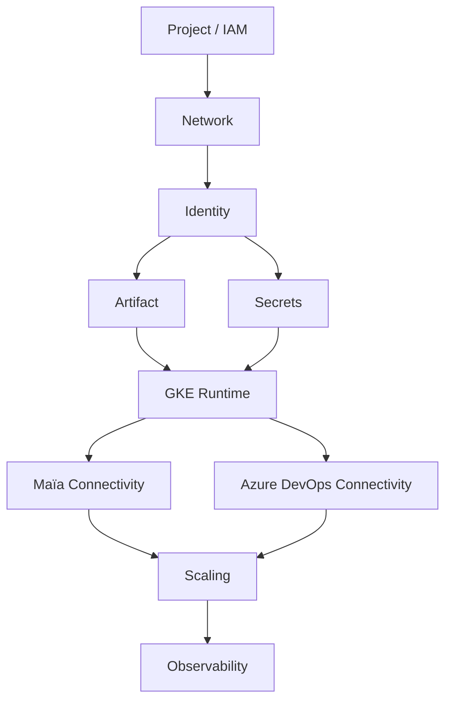

Khi review migration, đi theo thứ tự này sẽ ít bị bỏ sót dependency.

---

# 64. Kết luận

Để kiểm soát migration Maïa worker sang GCP, không cần học toàn bộ Google Cloud.

Ưu tiên hiểu sâu 10 nhóm:

```text
1. Resource hierarchy / Project
2. IAM
3. Service Account
4. VPC / Subnet / Firewall / NAT / DNS
5. GKE
6. Workload Identity Federation
7. Artifact Registry
8. Secret Manager
9. Cloud Logging / Monitoring
10. Scaling + Kubernetes troubleshooting
```

Với background Azure/AKS, phần Kubernetes concepts vẫn tái sử dụng được. Phần cần làm quen nhất khi chuyển sang GCP là:

```text
Project-centric resource model
IAM terminology
Service Accounts
Workload Identity
Shared VPC
Cloud NAT
API enablement
gcloud CLI
Cloud Logging / Monitoring
```
