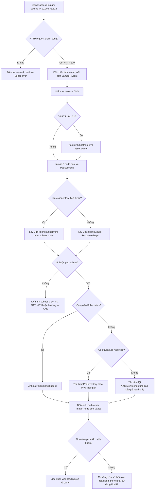

# Xác định source IP `10.205.73.128` trong luồng SonarQube / Power BI

## Mục tiêu

Xác định workload hoặc pod nào sử dụng source IP `10.205.73.128` để gọi SonarQube API trong quá trình thu thập dữ liệu phục vụ Power BI.

Phạm vi điều tra:

- Xác nhận IP xuất hiện ở đâu và thực hiện hành vi gì.
- Xác định IP có thuộc AKS/VNet/pod subnet hay không.
- Nếu có quyền phù hợp, ánh xạ `PodIp` về namespace, pod, workload và node pool.
- Ghi rõ phần đã xác nhận, phần suy luận và phần còn thiếu bằng chứng.

## Evidence

| Bằng chứng | Quan sát | Ý nghĩa |
| --- | --- | --- |
| SonarQube access log | Source IP `10.205.73.128` gọi nhiều Sonar API và nhận HTTP `200` | Kết nối đến SonarQube thành công; đây không phải lỗi mạng hoặc lỗi HTTP tại thời điểm ghi log |
| User-Agent | Linux Ubuntu `24.04.3`, PowerShell `7.6.3` | Có khả năng là script/collector/job chạy PowerShell trên Linux; chưa đủ để kết luận pod cụ thể |
| Reverse DNS | `nslookup 10.205.73.128` không trả PTR | Không thể xác định hostname qua DNS; điều này thường gặp với IP nội bộ/pod IP |
| Azure subscription hiện tại | Thấy AKS `aks-weu-scs-agent-pr` trong resource group `rg-weu-scs-aks-pr` | Đây là cluster ứng viên chính cần kiểm tra |
| Node pools | `npsystem1`, `npub01`, `npuserinfra1`, `npuserbuild1`, `npusersonar` | Tên `npusersonar` cho thấy có workload Sonar, nhưng không chứng minh source IP chạy trên pool này |
| Pod subnets | `snet-aks-scs-pods-01-pr`, `snet-aks-scs-pods-02-pr` | Cần lấy CIDR để kiểm tra `10.205.73.128` thuộc subnet nào |
| Quyền AKS | Thiếu `Microsoft.ContainerService/managedClusters/listClusterUserCredential/action` | Không thể lấy kubeconfig bằng `az aks get-credentials` |
| Quyền network | Thiếu `Microsoft.Network/virtualNetworks/subnets/read` | Không thể đọc subnet trực tiếp bằng `az network vnet subnet show` |
| Azure Resource Graph | Vẫn có thể truy vấn metadata resource | Đây là đường thay thế ưu tiên để lấy CIDR khi thiếu quyền đọc subnet trực tiếp |

## Step-by-step

### 1. Xác nhận hành vi từ SonarQube access log

Tìm tất cả request có source IP cần điều tra:

```bash
grep '10.205.73.128' <sonarqube-access-log>
```

Ghi nhận tối thiểu:

- Thời gian request, bao gồm múi giờ.
- API path và query string.
- HTTP method và status code.
- User-Agent.
- Số lượng/tần suất request.
- Nếu log có: authenticated user, token owner, request ID hoặc correlation ID.

Kết quả hiện tại: IP gọi nhiều Sonar API bằng PowerShell trên Linux và nhận HTTP `200`. Điều này phù hợp với một collector hoặc scheduled job, nhưng chưa xác định được nơi chạy.

### 2. Kiểm tra reverse DNS

```bash
nslookup 10.205.73.128
```

Hoặc:

```bash
dig -x 10.205.73.128
```

Không có PTR chỉ có nghĩa DNS không cung cấp hostname. Không được dùng kết quả này để kết luận IP không thuộc AKS.

### 3. Xác nhận Azure context và cluster ứng viên

```bash
az account show \
  --query "{Subscription:name,SubscriptionId:id,TenantId:tenantId,User:user.name}" \
  -o table
```

```bash
az aks list \
  --query "[].{Cluster:name,ResourceGroup:resourceGroup,Location:location}" \
  -o table
```

Cluster ứng viên đã tìm thấy:

```text
Resource group: rg-weu-scs-aks-pr
AKS cluster:    aks-weu-scs-agent-pr
```

Nếu không thấy cluster, kiểm tra lại subscription/tenant trước khi tiếp tục.

### 4. Thử lấy kubeconfig và ghi nhận lỗi quyền

```bash
az aks get-credentials \
  --resource-group rg-weu-scs-aks-pr \
  --name aks-weu-scs-agent-pr \
  --overwrite-existing
```

Nếu nhận `AuthorizationFailed` với action sau:

```text
Microsoft.ContainerService/managedClusters/listClusterUserCredential/action
```

thì account có thể đọc một số metadata AKS nhưng không được lấy user credential. Đây là lỗi Azure RBAC, không phải lỗi `kubectl`.

Lưu ý: lỗi `kubectl` do chưa có kubeconfig chỉ là triệu chứng ban đầu. Không nên tiếp tục chỉnh `kubectl` cho đến khi lấy được credentials hoặc có một kubeconfig hợp lệ từ quy trình được phê duyệt.

### 5. Liệt kê node pool và subnet đang sử dụng

```bash
az aks nodepool list \
  --resource-group rg-weu-scs-aks-pr \
  --cluster-name aks-weu-scs-agent-pr \
  --query "[].{Pool:name,VnetSubnetId:vnetSubnetId,PodSubnetId:podSubnetId,MaxPods:maxPods}" \
  -o table
```

Các pool đã quan sát:

```text
npsystem1
npub01
npuserinfra1
npuserbuild1
npusersonar
```

Các pod subnet đã quan sát:

```text
snet-aks-scs-pods-01-pr
snet-aks-scs-pods-02-pr
```

Lưu toàn bộ `PodSubnetId` để biết VNet, resource group mạng và subnet tương ứng. Một pod subnet có thể được nhiều node pool sử dụng; tên subnet không đủ để ánh xạ IP về một pool hoặc pod duy nhất.

### 6. Lấy CIDR bằng cách đọc subnet trực tiếp

Nếu có quyền network read:

```bash
az network vnet subnet show \
  --resource-group rg-weu-scs-network-pr \
  --vnet-name vnet-weu-scs-aks-01-pr \
  --name snet-aks-scs-pods-01-pr \
  --query "{Name:name,Prefix:addressPrefix,Prefixes:addressPrefixes}" \
  -o jsonc
```

Chạy tương tự cho `snet-aks-scs-pods-02-pr`.

Trong trường hợp hiện tại, lệnh bị chặn bởi:

```text
Microsoft.Network/virtualNetworks/subnets/read
```

Chuyển sang Azure Resource Graph ở bước tiếp theo.

### 7. Lấy CIDR qua Azure Resource Graph

Query các subnet cần kiểm tra:

```bash
az graph query -q "
Resources
| where type =~ 'microsoft.network/virtualnetworks'
| mv-expand subnet = properties.subnets
| where tostring(subnet.name) in (
    'snet-aks-scs-pods-01-pr',
    'snet-aks-scs-pods-02-pr',
    'snet-aks-scs-nodes-01-pr'
)
| project
    VNet=name,
    ResourceGroup=resourceGroup,
    Subnet=tostring(subnet.name),
    Prefix=tostring(subnet.properties.addressPrefix),
    Prefixes=tostring(subnet.properties.addressPrefixes)
" --first 1000 --query data -o table
```

Nếu `Prefix` rỗng nhưng `Prefixes` có dữ liệu, xem raw properties:

```bash
az graph query -q "
Resources
| where type =~ 'microsoft.network/virtualnetworks'
| mv-expand subnet = properties.subnets
| where tostring(subnet.name) == 'snet-aks-scs-pods-01-pr'
| project VNet=name, ResourceGroup=resourceGroup, Subnet=subnet.name, Properties=subnet.properties
" --first 100 --query data -o jsonc
```

Nếu query không trả dữ liệu, kiểm tra:

- Azure CLI đang ở đúng subscription.
- Resource Graph extension/provider có hoạt động.
- VNet metadata có được index trong Resource Graph hay không.
- Account có quyền đọc Resource Graph trên subscription chứa VNet hay không.

### 8. Kiểm tra IP có thuộc CIDR hay không

Ví dụ, nếu CIDR nhận được là `10.205.72.0/23`, dải địa chỉ là `10.205.72.0` đến `10.205.73.255`; khi đó `10.205.73.128` thuộc subnet này.

Có thể kiểm tra bằng PowerShell:

```powershell
$ip = [System.Net.IPAddress]::Parse('10.205.73.128')
$network = [System.Net.IPAddress]::Parse('10.205.72.0')
$mask = [System.Net.IPAddress]::Parse('255.255.254.0')

$ipBytes = $ip.GetAddressBytes()
$networkBytes = $network.GetAddressBytes()
$maskBytes = $mask.GetAddressBytes()

$matches = 0..3 | ForEach-Object {
    ($ipBytes[$_] -band $maskBytes[$_]) -eq
    ($networkBytes[$_] -band $maskBytes[$_])
}

($matches -notcontains $false)
```

Kết quả `True` chỉ xác nhận IP thuộc CIDR. Nó chưa chứng minh IP đang được gán cho pod nào tại thời điểm request.

### 9. Ánh xạ Pod IP bằng Kubernetes nếu được cấp quyền

Sau khi lấy được kubeconfig hợp lệ:

```bash
kubectl get pods -A -o wide --field-selector=status.podIP=10.205.73.128
```

Nếu API server hoặc phiên bản Kubernetes không hỗ trợ field selector này, dùng:

```bash
kubectl get pods -A -o wide | grep '10.205.73.128'
```

Sau khi tìm thấy pod:

```bash
kubectl get pod <pod-name> -n <namespace> -o yaml
kubectl describe pod <pod-name> -n <namespace>
kubectl get pod <pod-name> -n <namespace> -o jsonpath='{.spec.nodeName}{"\n"}'
kubectl get node <node-name> -L agentpool,kubernetes.azure.com/agentpool
```

Cần xác nhận:

- Namespace, pod và owner (`Deployment`, `StatefulSet`, `Job` hoặc `CronJob`).
- Container image và immutable image digest/tag.
- Node và node pool.
- Service account, ConfigMap/Secret reference và lịch chạy.
- Log của workload trong đúng khoảng thời gian request SonarQube.

Pod IP có thể được tái sử dụng sau khi pod bị xóa. Vì vậy, kết quả hiện tại của `kubectl` không đủ để chứng minh lịch sử nếu request đã xảy ra từ lâu.

### 10. Ánh xạ lịch sử bằng Log Analytics

Nếu AKS Container Insights gửi inventory vào Log Analytics, chạy KQL trong workspace chứa telemetry của cluster:

```kusto
KubePodInventory
| where TimeGenerated between (datetime(<start-utc>) .. datetime(<end-utc>))
| where PodIp == "10.205.73.128"
| project TimeGenerated, ClusterName, Namespace, Name, PodUid, PodIp, Computer, ContainerID
| order by TimeGenerated asc
```

Nếu tên cột khác theo schema của workspace, kiểm tra trước:

```kusto
KubePodInventory
| getschema
```

Sau khi có `ContainerID` hoặc pod name, đối chiếu log container:

```kusto
ContainerLogV2
| where TimeGenerated between (datetime(<start-utc>) .. datetime(<end-utc>))
| where PodName == "<pod-name>" and PodNamespace == "<namespace>"
| project TimeGenerated, PodNamespace, PodName, ContainerName, LogMessage
| order by TimeGenerated asc
```

Thay `<start-utc>` và `<end-utc>` bằng cửa sổ thời gian quanh access log SonarQube, có tính đến múi giờ. Đây là cách tốt hơn `kubectl` để điều tra một Pod IP trong quá khứ.

## Cách diễn giải kết quả

| Kết quả | Có thể kết luận | Chưa thể kết luận |
| --- | --- | --- |
| IP không thuộc CIDR của cả hai pod subnet | IP không phải pod IP từ các subnet AKS đã kiểm tra | IP thuộc VM, subnet khác, VPN/NAT hay hệ thống nào khác |
| IP thuộc một pod subnet | IP nằm trong không gian địa chỉ dành cho pod của cluster | Pod cụ thể, node pool cụ thể hoặc owner workload |
| `kubectl` tìm thấy pod hiện tại | IP hiện đang được pod đó sử dụng | Pod đó cũng sở hữu IP tại thời điểm log cũ |
| `KubePodInventory` khớp IP và thời gian | Pod/namespace đã sử dụng IP trong thời điểm cần điều tra | Người hoặc token đã khởi tạo request, nếu telemetry không chứa dữ liệu này |
| Pod log khớp API path và timestamp | Bằng chứng mạnh workload đó tạo request | Quyền truy cập có hợp lệ về mặt nghiệp vụ hay không |
| Chỉ thấy `npusersonar` dùng cùng subnet | Pool là một ứng viên | Source IP chắc chắn thuộc `npusersonar`; subnet có thể được chia sẻ |

## Trường hợp thiếu quyền

| Thiếu quyền | Ảnh hưởng | Cách tiếp tục | Quyền tối thiểu cần đề nghị |
| --- | --- | --- | --- |
| `listClusterUserCredential/action` | Không lấy được kubeconfig | Dùng Resource Graph và Log Analytics; nhờ đội AKS chạy lệnh ánh xạ IP | Role tùy chỉnh có action cần thiết hoặc vai trò AKS phù hợp, kết hợp Kubernetes RBAC read-only |
| `virtualNetworks/subnets/read` | Không đọc CIDR trực tiếp | Dùng Azure Resource Graph; nhờ Network team cung cấp subnet CIDR | `Reader` tại đúng subnet/VNet hoặc role tùy chỉnh chỉ cho phép read |
| Không có Kubernetes RBAC | Có kubeconfig nhưng không liệt kê pod/node | Dùng Log Analytics hoặc nhờ cluster operator xuất kết quả | Quyền `get/list` cho pods và nodes; tránh cấp cluster-admin chỉ để điều tra |
| Không có Log Analytics access | Không ánh xạ Pod IP lịch sử | Nhờ Monitoring team chạy KQL trong khung thời gian cụ thể | `Log Analytics Reader` trên workspace liên quan |

Khi yêu cầu quyền, áp dụng least privilege, giới hạn đúng subscription/resource group/cluster/workspace và thời gian cần thiết. Không yêu cầu `Owner`, `Contributor` hoặc `cluster-admin` chỉ cho hoạt động đọc.

## Decision tree



## Kết luận hiện tại

Đã xác nhận:

- `10.205.73.128` gọi SonarQube API thành công bằng PowerShell `7.6.3` trên Ubuntu `24.04.3`.
- Reverse DNS không có PTR hữu ích.
- Subscription hiện tại có AKS `aks-weu-scs-agent-pr` trong `rg-weu-scs-aks-pr`.
- Cluster có các node pool, bao gồm `npusersonar`, và sử dụng hai pod subnet `snet-aks-scs-pods-01-pr` / `snet-aks-scs-pods-02-pr`.
- Việc lấy AKS credentials và đọc subnet trực tiếp đang bị chặn bởi Azure RBAC.

Chưa thể kết luận:

- `10.205.73.128` có thực sự thuộc một trong hai pod subnet hay không, cho đến khi lấy được CIDR.
- IP thuộc pod, namespace, workload hoặc node pool nào.
- Workload nguồn có phải Power BI collector/job hay không.

Bước tiếp theo được khuyến nghị:

1. Chạy Azure Resource Graph query để lấy CIDR của hai pod subnet.
2. Kiểm tra `10.205.73.128` có thuộc CIDR nào không.
3. Nếu thuộc pod subnet, ưu tiên query `KubePodInventory` theo đúng thời điểm trong Sonar access log để tránh sai lệch do tái sử dụng Pod IP.
4. Đối chiếu pod/container log với timestamp, API path và User-Agent.
5. Xác nhận workload owner, token owner và mục đích nghiệp vụ trước khi thay đổi hoặc chặn traffic.

Kết luận tạm thời hợp lý nhất là `10.205.73.128` có đặc điểm của một Linux-based PowerShell collector/job gọi SonarQube. Tuy nhiên, chưa có đủ bằng chứng để khẳng định đây là một pod AKS hoặc thuộc `npusersonar`.


