# Network & Server Troubleshooting Cheat Sheet for Technical Advisor

> Mục tiêu: tài liệu tham khảo nhanh khi investigate network, DNS, TLS/SSL, IIS, Azure, AKS/Kubernetes, proxy/load balancer/F5, SQL Server và connectivity giữa các hệ thống.
>
> Ưu tiên theo tư duy: **DNS → Route → TCP Port → TLS → HTTP/Application → Backend logs → Infra path**.


> **Version 4 — 18 Aug 2026:** bổ sung OSI standard model, TA troubleshooting model, command mapping theo layer và issue classification.
>
> Previous: **Version 3 — 18 Aug 2026:** bổ sung Mermaid investigation flows theo từng scenario.
>
> Previous: **Version 2 — 18 Aug 2026:** bổ sung `Command Lab` với **input → output mẫu → cách đọc kết quả**, các case thực tế Cerebro/F5/IIS, và workflow dành cho TA.

---

## 1. Quy trình chuẩn khi troubleshoot connectivity

Khi một service A không gọi được service B, kiểm tra theo thứ tự:

```text
1. DNS resolve đúng IP chưa?
2. Route tới IP đó có tồn tại không?
3. TCP port có mở không?
4. TLS handshake có thành công không?
5. HTTP/API có trả response không?
6. Request có tới backend server không?
7. Backend thấy source IP nào?
8. Có proxy / F5 / load balancer / firewall / NAT ở giữa không?
9. Nếu chạy trong Azure/AKS: effective route, NSG, private endpoint, DNS zone có đúng không?
```

---


---

# 2. OSI Troubleshooting Map for TA

> Mục tiêu của phần này không phải học thuộc OSI để thi network.  
> Mục tiêu là dùng OSI như một **mental model** để biết issue đang fail ở tầng nào, command nào nên chạy trước, và nên involve team nào.

---

## 2.1 Mô hình OSI chuẩn 7 tầng

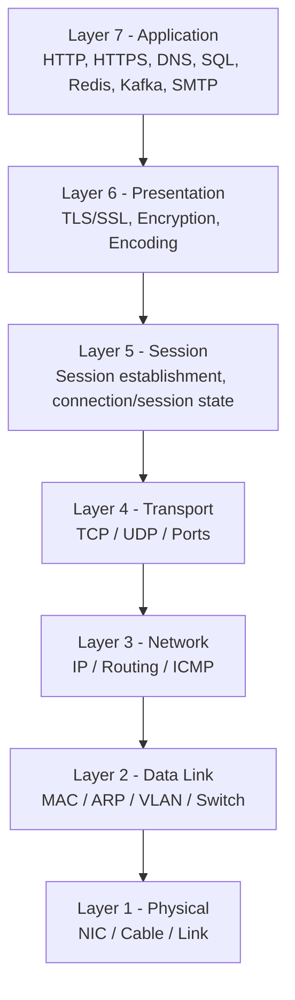

| OSI Layer | Tên | Ví dụ thực tế trong công việc |
|---|---|---|
| 7 | Application | HTTP, REST API, DNS, SQL Server, Redis, Kafka, SMTP |
| 6 | Presentation | TLS/SSL, certificate, encryption, encoding |
| 5 | Session | TLS session, application session, persistent connection |
| 4 | Transport | TCP/UDP, port 443/1433/6379/9092 |
| 3 | Network | IP, routing, ICMP, VPN, ExpressRoute |
| 2 | Data Link | MAC, ARP, VLAN, switch |
| 1 | Physical | NIC, cable, physical link |

### Lưu ý quan trọng

Trong troubleshooting thực tế:

- DNS thuộc Layer 7 nhưng phải kiểm tra **rất sớm**
- TLS thường được gom vào Layer 5/6
- Application protocol như HTTP, SQL, Redis, Kafka đều nằm phía trên TCP
- Không phải issue nào cũng cần đi đủ 7 tầng

Vì vậy với role TA, nên dùng một mô hình rút gọn dễ nhớ hơn.

---

## 2.2 Mô hình dễ nhớ hơn OSI cho Technical Advisor

### Recommended mental model

```text
NAME
  ↓
PATH
  ↓
PORT
  ↓
TLS
  ↓
PROTOCOL
  ↓
APPLICATION
```

Hoặc nhớ thành:

> **Name → Path → Port → TLS → Protocol → App**

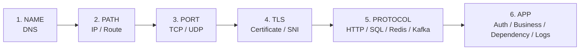

### Ý nghĩa từng bước

| Bước | Câu hỏi cần trả lời | Tool chính |
|---|---|---|
| NAME | Hostname resolve đúng IP chưa? | `nslookup`, `Resolve-DnsName`, `dig` |
| PATH | Có route tới IP đó không? | `ping`, `tracert`, `pathping`, `route print`, `ip route` |
| PORT | TCP/UDP port có reachable không? | `Test-NetConnection`, `tcpping`, `nc` |
| TLS | TLS handshake/certificate có OK không? | `curl -v`, `curl -vk`, `openssl s_client` |
| PROTOCOL | HTTP/SQL/Redis/Kafka protocol có phản hồi không? | `curl`, `sqlcmd`, `redis-cli`, Kafka tools |
| APP | Auth/business/dependency có lỗi không? | IIS logs, App Insights, `kubectl logs`, application logs |

### Tại sao mô hình này dễ dùng hơn OSI?

Vì khi incident xảy ra, TA thường cần trả lời:

```text
Issue fail ở đâu?
Network hay App?
Cần involve team nào?
Evidence nào chứng minh?
```

Mô hình này map trực tiếp vào công việc hơn:

```text
DNS fail
→ chưa cần hỏi App team

TCP fail
→ chưa cần debug token

TLS fail
→ network path có thể vẫn OK

HTTP 401
→ network/TLS đã pass, investigate auth

HTTP 500
→ application/dependency
```

---

## 2.3 Gom nhóm command theo layer

### Layer 1-2 — Local network / interface

```powershell
ipconfig /all
Get-NetAdapter
Get-NetIPAddress
arp -a
```

Linux:

```bash
ip addr
ip -br addr
ip neigh
```

Dùng khi:

- NIC down
- sai IP
- sai subnet
- gateway sai
- ARP/local LAN issue

---

### Layer 3 — IP / Routing

Windows:

```powershell
ping <host>
tracert <host>
pathping <host>
route print
Get-NetRoute
```

Linux:

```bash
ping <host>
traceroute <host>
ip route
ip route get <ip>
```

Dùng khi:

- không reach được destination network
- nghi WAN/VPN/ExpressRoute
- nghi route sai
- asymmetric routing
- UDR/NVA/Firewall path

---

### Layer 4 — TCP / UDP / Port

Windows:

```powershell
Test-NetConnection <host> -Port 443
tcpping <host> 443
netstat -ano
Get-NetTCPConnection
```

Linux:

```bash
nc -vz <host> 443
ss -lntp
```

Dùng khi:

- cần biết port có mở không
- firewall/NSG
- service không listen
- F5 listener
- SQL/Redis/Kafka connectivity

---

### Layer 5-6 — TLS / SSL / Session

```powershell
curl.exe -v https://<host>
curl.exe -vk https://<host>
```

Linux/WSL:

```bash
openssl s_client -connect <host>:443 -servername <host>
```

PowerShell:

```powershell
# SslStream remote certificate inspection
```

Dùng khi:

- certificate expired
- hostname mismatch
- chain not trusted
- SNI
- TLS handshake failure
- F5 Client SSL / Server SSL profile

---

### Layer 7 — DNS / HTTP / Application protocols

DNS:

```powershell
nslookup <host>
Resolve-DnsName <host>
```

HTTP:

```powershell
curl.exe -v https://<host>
curl.exe -vkI https://<host>
curl.exe -vk "https://<host>/?trace=tri-test"
```

SQL:

```powershell
sqlcmd -S tcp:<sql-host>,1433 -E
```

Redis:

```bash
redis-cli -h <host> -p 6380 --tls ping
```

Application/server logs:

```powershell
Select-String -Path "C:\inetpub\logs\LogFiles\W3SVC*\u_ex*.log" -Pattern "trace-id"
```

Kubernetes:

```bash
kubectl logs <pod> -n <ns>
kubectl describe pod <pod> -n <ns>
```

---

## 2.4 Mapping command → câu hỏi nó trả lời

| Command | Câu hỏi nó trả lời |
|---|---|
| `ipconfig /all` | Máy này có IP/gateway/DNS gì? |
| `nslookup` | Hostname resolve ra IP nào? |
| `Resolve-DnsName` | DNS record cụ thể là gì? |
| `ping` | ICMP reach được không? |
| `tracert` | Route tới destination đi qua những hop nào? |
| `pathping` | Có packet loss ở path nào không? |
| `Test-NetConnection -Port` | TCP port reachable không? |
| `tcpping` | TCP port reachable + latency thế nào? |
| `netstat` / `ss` | Server có listen port không? Connection hiện tại là gì? |
| `curl -v` | DNS/TCP/TLS/HTTP flow trông thế nào? |
| `curl -k` | Nếu bỏ cert validation thì request có đi tiếp không? |
| `curl --resolve` | Bypass DNS nhưng giữ Host/SNI được không? |
| `openssl s_client` | TLS/certificate/chain/SNI ra sao? |
| IIS log | Request có tới backend không? Backend thấy source IP nào? |
| `kubectl logs` | Pod/application lỗi gì? |
| `kubectl describe` | Pod/probe/image/scheduling/event lỗi gì? |
| Effective Routes | Azure traffic đi next hop nào? |
| Effective NSG | Azure NIC/subnet đang bị rule nào allow/deny? |

---

## 2.5 Recommend cách dùng OSI cho TA

### Không nên dùng OSI theo kiểu học thuộc

Không cần bắt đầu incident bằng:

```text
"Đây là Layer 3 hay Layer 4?"
```

Nên hỏi:

```text
Layer dưới đã pass chưa?
```

Ví dụ:

```text
DNS ✅
TCP 443 ✅
TLS ✅
HTTP 401 ❌
```

Kết luận:

```text
Không phải network issue.
Investigate authentication/application.
```

Ngược lại:

```text
DNS ✅
TCP 1433 ❌
```

Kết luận:

```text
Chưa cần debug EF Core / SQL login.
Network path tới SQL chưa pass.
```

---

## 2.6 Phân loại issue và mô hình nên áp dụng

| Loại issue | Mô hình nên dùng | Entry point |
|---|---|---|
| API không gọi được | Name → Path → Port → TLS → HTTP → App | DNS |
| SQL không connect | Name → Path → Port → SQL/Auth | DNS/TCP 1433 |
| Redis không connect | Name → Path → Port → TLS/Auth | DNS/TCP 6379/6380 |
| Kafka/Event Hubs | Name → Path → Port → TLS/Auth/Protocol | DNS/TCP 9092/9093 |
| SSL expired/mismatch | Port → TLS → Certificate → Binding/F5 | TCP 443 |
| F5/LB suspicion | DNS → Destination IP → curl → backend log → compare IP | DNS/curl |
| IIS 500/503 | TCP/TLS → localhost test → IIS log → app pool/app logs | localhost |
| AKS pod không gọi DB/API | DNS in pod → TCP → route/NSG → TLS → app | inside pod |
| Azure VM không tới on-prem | DNS → route → Effective Route → NSG → ExpressRoute/VPN | L3 |
| Pipeline agent không access server | Agent runtime → DNS → TCP → egress IP → firewall | source network |
| HTTP 401 | Skip network if HTTP received; investigate identity/auth | L7 |
| HTTP 403 | AuthZ/IIS/WAF/ACL | L7 |
| HTTP 502 | Gateway reached; investigate gateway → backend | L7/L4 backend |
| HTTP 504 | Backend slow/unreachable from gateway | L7 + dependency |
| DNS khác nhau giữa region | DNS server → split DNS/GTM → VIP comparison | DNS |
| Random timeout/packet loss | Path → pathping → TCP timing → backend latency | L3/L4 |

---

## 2.7 Decision matrix: issue nào involve team nào?

| Evidence | Layer nghi ngờ | Team thường involve |
|---|---|---|
| DNS không resolve | DNS/L7 infra | Network / DNS / Cloud |
| Resolve đúng nhưng TCP fail | L3/L4 | Network / Cloud / Firewall |
| TCP OK, TLS fail | L5/L6 | F5 / Windows / Cloud / App |
| TLS OK, HTTP 401 | L7 Auth | App / Identity |
| TLS OK, HTTP 403 | L7 AuthZ/WAF/IIS | App / F5 / Identity |
| HTTP 500 | Application | Dev/App team |
| HTTP 502 | Gateway → Backend | F5/Ingress + App |
| HTTP 503 | Backend unavailable | App/Platform |
| HTTP 504 | Backend slow/timeout | App + DB/Dependency + Gateway |
| Pod DNS fail | DNS/AKS | Platform/Cloud |
| Pod TCP fail | L3/L4 | Platform/Network/Cloud |
| SQL TCP OK nhưng login fail | L7/Auth | DBA/App |
| F5 VIP reachable nhưng backend không có log | LB/backend path | F5/Network/App |

---

## 2.8 OSI-based investigation flow

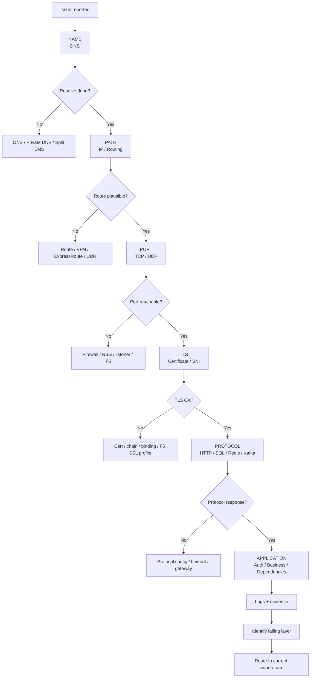

---

## 2.9 Ví dụ áp dụng: Cerebro

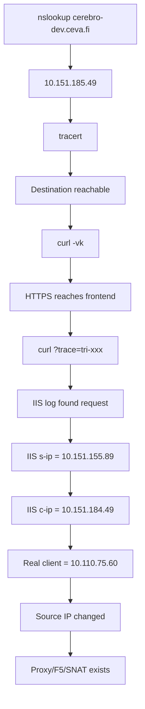

### Interpretation theo mô hình rút gọn

```text
NAME     ✅ cerebro-dev.ceva.fi → 10.151.185.49
PATH     ✅ tracert reaches destination
PORT     ✅ HTTPS/TCP reachable
TLS      ✅ handshake proceeds
PROTOCOL ✅ IIS returns HTTP response
APP      ✅ request appears in IIS log
INFRA    → source IP changed before backend
```

Kết luận:

```text
Không phải generic connectivity issue.
Có frontend/load balancer/NAT ở giữa.
Tiếp tục investigate F5 VIP/SNAT/SSL profile.
```

---

## 2.10 Quy tắc quan trọng khi dùng OSI

### Rule 1 — Không skip layer dưới

Nếu TCP chưa pass:

```text
đừng debug OAuth token
đừng debug SQL login
đừng debug business code
```

### Rule 2 — HTTP response là evidence rất mạnh

Nếu nhận:

```text
401
403
404
500
```

thì ít nhất:

```text
DNS
TCP
TLS
HTTP transport
```

đã đi được tới một HTTP endpoint.

### Rule 3 — `ping` không đại diện cho application connectivity

```text
ping fail
TCP 443 success
```

hoàn toàn có thể xảy ra.

### Rule 4 — Một command không đủ để kết luận topology

Ví dụ:

```text
nslookup → 10.151.185.49
```

chỉ cho biết destination DNS.

Cần ghép:

```text
nslookup
+ tracert
+ curl
+ backend logs
```

mới suy luận F5/VIP/SNAT tốt hơn.

### Rule 5 — Kết luận bằng evidence, không bằng assumption

Một summary tốt:

```text
DNS resolves to 10.151.185.49.
Client can establish HTTPS connectivity.
The request marker appears on IIS backend 10.151.155.89.
IIS sees source IP 10.151.184.49 instead of client IP 10.110.75.60.
Therefore, an intermediary proxy/load balancer/NAT exists between client and backend.
```

Tốt hơn:

```text
"It must be F5."
```

nếu chưa có F5 configuration để confirm.

---

# 3. DNS

## 3.1 nslookup

### Resolve hostname

```powershell
nslookup cerebro-dev.ceva.fi
```

Dùng để xem:

- hostname resolve ra IP nào
- DNS server nào đang trả lời
- có split DNS hay không

Ví dụ:

```text
Server:  BSGAPFDNS001VM.btl.bollore.com
Address: 10.147.131.101

Name:    cerebro-dev.ceva.fi
Address: 10.151.185.49
```

### Reverse lookup IP

```powershell
nslookup 10.151.185.49
```

Dùng để xem PTR record / reverse DNS.

---

## 3.2 Resolve-DnsName

PowerShell hiện đại hơn `nslookup`.

```powershell
Resolve-DnsName cerebro-dev.ceva.fi
```

### Reverse PTR

```powershell
Resolve-DnsName 10.151.185.49 -Type PTR
```

### Chỉ lấy IP

```powershell
Resolve-DnsName cerebro-dev.ceva.fi |
Where-Object Type -eq "A" |
Select-Object Name, IPAddress
```

### Query một DNS server cụ thể

```powershell
Resolve-DnsName cerebro-dev.ceva.fi -Server 10.147.131.101
```

Hữu ích khi nghi ngờ:

- DNS cache
- DNS khác nhau giữa Vietnam / France
- split-horizon DNS
- regional DNS

---

## 3.3 Clear DNS cache

Windows:

```powershell
ipconfig /flushdns
```

Kiểm tra DNS cache:

```powershell
ipconfig /displaydns
```

PowerShell:

```powershell
Get-DnsClientCache
```

---

# 3. Ping / ICMP

## 3.1 ping

```powershell
ping 10.151.185.49
```

hoặc:

```powershell
ping cerebro-dev.ceva.fi
```

Dùng để:

- kiểm tra DNS resolve
- kiểm tra ICMP reachability
- xem latency cơ bản

### Ping liên tục

```powershell
ping -t cerebro-dev.ceva.fi
```

### Ping số lần cụ thể

```powershell
ping -n 10 cerebro-dev.ceva.fi
```

### Lưu ý

`ping fail` **không đồng nghĩa server down**.

Firewall thường block ICMP nhưng vẫn cho TCP 443.

Ví dụ:

```text
ping fail
TCP 443 success
```

=> HTTPS vẫn hoạt động bình thường.

---

# 4. TCP Port Connectivity

## 4.1 Test-NetConnection

Đây là lệnh PowerShell nên ưu tiên trên Windows.

```powershell
Test-NetConnection cerebro-dev.ceva.fi -Port 443
```

Output quan trọng:

```text
RemoteAddress    : 10.151.185.49
RemotePort       : 443
TcpTestSucceeded : True
```

### SQL Server

```powershell
Test-NetConnection sqlserver01 -Port 1433
```

### Redis

```powershell
Test-NetConnection redis01 -Port 6379
```

Azure Redis TLS:

```powershell
Test-NetConnection myredis.redis.cache.windows.net -Port 6380
```

### Kafka

```powershell
Test-NetConnection kafka01 -Port 9092
```

### MongoDB

```powershell
Test-NetConnection mongodb01 -Port 27017
```

### HTTPS

```powershell
Test-NetConnection api.company.internal -Port 443
```

---

## 4.2 tcpping

`tcpping` không có sẵn trên mọi Windows machine.

Ví dụ nếu đã cài:

```cmd
tcpping cerebro-dev.ceva.fi 443
```

Hữu ích để:

- test TCP tương tự ping
- xem latency qua TCP
- monitor port liên tục

Nếu không có `tcpping`, dùng:

```powershell
Test-NetConnection hostname -Port 443
```

---

## 4.3 Telnet

Nếu Telnet Client được enable:

```cmd
telnet server01 443
```

hoặc:

```cmd
telnet sqlserver01 1433
```

Nếu màn hình chuyển blank thì TCP connection thường đã mở.

Không ưu tiên vì ít thông tin hơn `Test-NetConnection`.

---

## 4.4 nc / netcat - Linux / WSL

```bash
nc -vz cerebro-dev.ceva.fi 443
```

SQL:

```bash
nc -vz sqlserver01 1433
```

Kafka:

```bash
nc -vz kafka01 9092
```

Scan một range:

```bash
nc -vz server01 8000-8100
```

---

# 5. Route / Network Path

## 5.1 tracert - Windows

```powershell
tracert cerebro-dev.ceva.fi
```

Dùng để xem route/hops từ client tới destination.

Ví dụ:

```text
Client
  ↓
Gateway
  ↓
Corporate WAN
  ↓
Router
  ↓
F5 VIP
```

### Không nên dùng tracert để kết luận

- hop cuối chắc chắn là F5
- request HTTP đi qua proxy nào
- F5 SNAT IP là gì

`tracert` chỉ mô tả route tới destination IP.

---

## 5.2 traceroute - Linux

```bash
traceroute cerebro-dev.ceva.fi
```

Nếu chưa có:

```bash
sudo apt install traceroute
```

---

## 5.3 pathping

Windows:

```powershell
pathping cerebro-dev.ceva.fi
```

Kết hợp:

- route
- packet loss từng hop

Hữu ích khi nghi ngờ:

- intermittent network
- packet loss
- WAN latency

Lưu ý: chạy khá lâu.

---

## 5.4 route print

Windows:

```powershell
route print
```

Dùng để xem local routing table.

Chỉ IPv4:

```powershell
route print -4
```

---

## 5.5 Get-NetRoute

PowerShell:

```powershell
Get-NetRoute -AddressFamily IPv4 |
Sort-Object DestinationPrefix
```

Tìm route cụ thể:

```powershell
Get-NetRoute |
Where-Object DestinationPrefix -like "10.151*"
```

---

# 6. curl - HTTP / HTTPS / TLS

## 6.1 Basic

```powershell
curl.exe https://cerebro-dev.ceva.fi
```

> Trên PowerShell nên dùng `curl.exe` để chắc chắn gọi curl thật.

---

## 6.2 Verbose

```powershell
curl.exe -v https://cerebro-dev.ceva.fi
```

`-v` = verbose.

Cho thấy:

- IP resolve
- TCP connection
- TLS handshake
- HTTP request headers
- response headers

---

## 6.3 Ignore certificate validation

```powershell
curl.exe -k https://cerebro-dev.ceva.fi
```

`-k` = insecure.

Bỏ qua:

- expired certificate
- self-signed
- hostname mismatch
- untrusted chain

Chỉ dùng để debug.

---

## 6.4 Verbose + insecure

```powershell
curl.exe -vk https://cerebro-dev.ceva.fi
```

Đây là combo troubleshoot SSL phổ biến.

---

## 6.5 HEAD request

```powershell
curl.exe -vkI https://cerebro-dev.ceva.fi
```

`-I` chỉ lấy response headers.

Hữu ích kiểm tra:

- server
- redirect
- load balancer cookie
- status code

Tìm F5 cookie:

```text
Set-Cookie: BIGipServer...
```

Nếu có, đây là dấu hiệu rất mạnh của F5 BIG-IP.

---

## 6.6 Add marker để tìm IIS log

```powershell
curl.exe -vk "https://cerebro-dev.ceva.fi/?trace=tri-test-001"
```

Sau đó backend:

```powershell
Select-String `
  -Path "C:\inetpub\logs\LogFiles\W3SVC*\u_ex*.log" `
  -Pattern "tri-test-001"
```

Đây là cách rất hữu ích để xác nhận:

```text
Client → Load Balancer/F5 → IIS backend
```

---

## 6.7 Force hostname tới IP cụ thể

```powershell
curl.exe -vk `
  --resolve cerebro-dev.ceva.fi:443:127.0.0.1 `
  https://cerebro-dev.ceva.fi
```

Dùng để bypass DNS nhưng vẫn giữ:

- HTTP Host header
- TLS SNI hostname

Rất hữu ích để test trực tiếp IIS local.

Test backend IP:

```powershell
curl.exe -vk `
  --resolve cerebro-dev.ceva.fi:443:10.151.155.89 `
  https://cerebro-dev.ceva.fi
```

So sánh với F5:

```powershell
curl.exe -vk `
  --resolve cerebro-dev.ceva.fi:443:10.151.185.49 `
  https://cerebro-dev.ceva.fi
```

---

## 6.8 Add headers

Bearer token:

```powershell
curl.exe -vk `
  -H "Authorization: Bearer <token>" `
  https://api.company.com/api/users
```

Content-Type:

```powershell
curl.exe -vk `
  -H "Content-Type: application/json" `
  https://api.company.com
```

Custom debug header:

```powershell
curl.exe -vk `
  -H "X-Debug-Trace: tri-test-001" `
  https://api.company.com
```

---

## 6.9 POST JSON

```powershell
curl.exe -vk `
  -X POST `
  -H "Content-Type: application/json" `
  -d '{"name":"test"}' `
  https://api.company.com/api/items
```

---

## 6.10 Follow redirect

```powershell
curl.exe -vkL https://api.company.com
```

`-L` follow HTTP 301/302.

---

## 6.11 Timeout

```powershell
curl.exe -vk `
  --connect-timeout 5 `
  --max-time 20 `
  https://api.company.com
```

---

## 6.12 Show timing

```powershell
curl.exe -s -o NUL `
  -w "DNS:%{time_namelookup} TCP:%{time_connect} TLS:%{time_appconnect} TTFB:%{time_starttransfer} TOTAL:%{time_total}`n" `
  https://api.company.com
```

Hữu ích phân biệt:

- DNS chậm
- TCP chậm
- TLS chậm
- backend chậm

Linux:

```bash
curl -s -o /dev/null \
  -w 'DNS:%{time_namelookup} TCP:%{time_connect} TLS:%{time_appconnect} TTFB:%{time_starttransfer} TOTAL:%{time_total}\n' \
  https://api.company.com
```

---

# 7. TLS / SSL Certificate

## 7.1 OpenSSL - xem certificate

Linux/WSL:

```bash
openssl s_client \
  -connect cerebro-dev.ceva.fi:443 \
  -servername cerebro-dev.ceva.fi
```

Chỉ xem certificate:

```bash
openssl s_client \
  -connect cerebro-dev.ceva.fi:443 \
  -servername cerebro-dev.ceva.fi \
  </dev/null 2>/dev/null |
openssl x509 -noout -subject -issuer -dates -serial -fingerprint
```

---

## 7.2 Test IP cụ thể nhưng vẫn dùng SNI

```bash
openssl s_client \
  -connect 10.151.185.49:443 \
  -servername cerebro-dev.ceva.fi
```

Dùng để xác định cert mà F5 VIP đang serve.

---

## 7.3 PowerShell lấy remote certificate

```powershell
$tcp = [System.Net.Sockets.TcpClient]::new(
    "cerebro-dev.ceva.fi",
    443
)

$ssl = [System.Net.Security.SslStream]::new(
    $tcp.GetStream(),
    $false,
    { $true }
)

$ssl.AuthenticateAsClient("cerebro-dev.ceva.fi")

$cert = [System.Security.Cryptography.X509Certificates.X509Certificate2]::new(
    $ssl.RemoteCertificate
)

$cert | Format-List `
    Subject,
    Issuer,
    Thumbprint,
    SerialNumber,
    NotBefore,
    NotAfter

$ssl.Dispose()
$tcp.Dispose()
```

---

## 7.4 Test IIS localhost với SNI

```powershell
$tcp = [System.Net.Sockets.TcpClient]::new(
    "127.0.0.1",
    443
)

$ssl = [System.Net.Security.SslStream]::new(
    $tcp.GetStream(),
    $false,
    { $true }
)

$ssl.AuthenticateAsClient("cerebro-dev.ceva.fi")

$cert = [System.Security.Cryptography.X509Certificates.X509Certificate2]::new(
    $ssl.RemoteCertificate
)

$cert | Format-List Subject,Issuer,Thumbprint,NotBefore,NotAfter

$ssl.Dispose()
$tcp.Dispose()
```

---

## 7.5 Xem cert trong LocalMachine store

```powershell
Get-ChildItem Cert:\LocalMachine\My |
Select Subject, Thumbprint, NotBefore, NotAfter, HasPrivateKey
```

Filter domain:

```powershell
Get-ChildItem Cert:\LocalMachine\My |
Where-Object Subject -like "*cerebro-dev.ceva.fi*" |
Select Subject, Thumbprint, NotBefore, NotAfter, HasPrivateKey
```

---

## 7.6 Import certificate sau CSR

Nếu CSR được tạo trên chính server:

```powershell
certreq -accept C:\Temp\cerebro-dev.ceva.fi.cer
```

Sau đó kiểm tra:

```powershell
Get-ChildItem Cert:\LocalMachine\My |
Where-Object Subject -like "*cerebro-dev.ceva.fi*" |
Select Subject,Thumbprint,NotAfter,HasPrivateKey
```

---

# 8. IIS Troubleshooting

## 8.1 IIS logs

Default:

```text
C:\inetpub\logs\LogFiles\
```

Ví dụ:

```text
C:\inetpub\logs\LogFiles\W3SVC1\
C:\inetpub\logs\LogFiles\W3SVC2\
```

---

## 8.2 Search marker

```powershell
Select-String `
  -Path "C:\inetpub\logs\LogFiles\W3SVC*\u_ex*.log" `
  -Pattern "tri-test-001"
```

---

## 8.3 IIS log fields quan trọng

Ví dụ:

```text
date
time
s-ip
cs-method
cs-uri-stem
cs-uri-query
s-port
cs-username
c-ip
cs(User-Agent)
sc-status
sc-substatus
sc-win32-status
time-taken
```

### s-ip

Server IP nhận request.

### c-ip

IP mà IIS thấy là client trực tiếp.

Nếu:

```text
real client = 10.110.75.60
IIS c-ip    = 10.151.184.49
```

=> có proxy/load balancer/SNAT ở giữa.

### sc-status

HTTP status:

```text
200 OK
401 Unauthorized
403 Forbidden
404 Not Found
500 Internal Server Error
502 Bad Gateway
503 Service Unavailable
```

### sc-substatus

Ví dụ:

```text
403.14
```

= Directory listing denied / no default document.

---

## 8.4 IIS bindings command line

```powershell
Import-Module WebAdministration
Get-WebBinding
```

Filter HTTPS:

```powershell
Get-WebBinding -Protocol https
```

---

## 8.5 IIS site state

```powershell
Get-Website
```

Restart site:

```powershell
Restart-WebItem "IIS:\Sites\Cerebro"
```

Hoặc:

```powershell
Stop-Website Cerebro
Start-Website Cerebro
```

Production: tránh `iisreset` nếu không thực sự cần.

---

# 9. F5 / Load Balancer Investigation

## 9.1 Xác định VIP

Từ client:

```powershell
Resolve-DnsName cerebro-dev.ceva.fi
```

hoặc:

```powershell
curl.exe -vk https://cerebro-dev.ceva.fi
```

Dòng:

```text
Trying 10.151.185.49:443...
```

=> IP mà client connect tới.

Đây thường là VIP.

---

## 9.2 Xác định SNAT / proxy source IP

Backend IIS log:

```text
c-ip = 10.151.184.49
```

Nếu client thật:

```text
10.110.75.60
```

=> F5/proxy đã SNAT request.

Topology ví dụ:

```text
Client
10.110.75.60
      |
      v
F5 VIP
10.151.185.49
      |
      | SNAT
      v
10.151.184.49
      |
      v
IIS
10.151.155.89
```

---

## 9.3 Reverse lookup VIP

```powershell
Resolve-DnsName 10.151.185.49 -Type PTR
```

---

## 9.4 Tìm BIG-IP cookie

```powershell
curl.exe -vkI https://cerebro-dev.ceva.fi
```

Tìm:

```text
BIGipServer
```

Có cookie này => bằng chứng rất mạnh F5 BIG-IP.

Không có cookie ≠ không có F5.

---

# 10. Windows Server / Local Network

## 10.1 IP configuration

```powershell
ipconfig
```

Full:

```powershell
ipconfig /all
```

Quan trọng:

- IPv4
- subnet mask
- gateway
- DNS servers
- DNS suffix

---

## 10.2 Hostname

```powershell
hostname
```

hoặc:

```powershell
$env:COMPUTERNAME
```

---

## 10.3 Network adapters

```powershell
Get-NetAdapter
```

Only active:

```powershell
Get-NetAdapter |
Where-Object Status -eq "Up"
```

---

## 10.4 IP addresses

```powershell
Get-NetIPAddress -AddressFamily IPv4
```

---

## 10.5 DNS configuration

```powershell
Get-DnsClientServerAddress
```

---

## 10.6 Active connections

```powershell
netstat -ano
```

HTTPS:

```powershell
netstat -ano | findstr :443
```

SQL:

```powershell
netstat -ano | findstr :1433
```

Listening only:

```powershell
netstat -ano | findstr LISTENING
```

---

## 10.7 Modern alternative to netstat

```powershell
Get-NetTCPConnection
```

Port 443:

```powershell
Get-NetTCPConnection -LocalPort 443
```

Established:

```powershell
Get-NetTCPConnection -State Established
```

---

## 10.8 Find process by PID

```powershell
tasklist /FI "PID eq 1234"
```

PowerShell:

```powershell
Get-Process -Id 1234
```

---

# 11. Windows Firewall

## 11.1 View firewall state

```powershell
Get-NetFirewallProfile
```

---

## 11.2 Find rules

```powershell
Get-NetFirewallRule |
Where-Object DisplayName -like "*IIS*"
```

---

## 11.3 Port filters

```powershell
Get-NetFirewallPortFilter
```

---

# 12. Proxy

## 12.1 WinHTTP proxy

```powershell
netsh winhttp show proxy
```

---

## 12.2 Environment variables

```powershell
Get-ChildItem Env:HTTP_PROXY
Get-ChildItem Env:HTTPS_PROXY
Get-ChildItem Env:NO_PROXY
```

CMD:

```cmd
set | findstr /i proxy
```

---

## 12.3 curl bypass proxy

```powershell
curl.exe --noproxy "*" -vk https://api.company.com
```

Hoặc một host:

```powershell
curl.exe --noproxy api.company.com -vk https://api.company.com
```

---

# 13. Linux / WSL Network Commands

## IP

```bash
ip addr
```

Short:

```bash
ip -br addr
```

---

## Route

```bash
ip route
```

Route tới destination:

```bash
ip route get 10.151.185.49
```

---

## DNS

```bash
nslookup cerebro-dev.ceva.fi
```

```bash
dig cerebro-dev.ceva.fi
```

Short answer:

```bash
dig +short cerebro-dev.ceva.fi
```

Reverse:

```bash
dig -x 10.151.185.49
```

---

## Listening ports

```bash
ss -lntp
```

Port 443:

```bash
ss -lntp | grep :443
```

Established:

```bash
ss -ntp
```

---

## Process using port

```bash
sudo lsof -i :443
```

---

# 14. Azure Network Troubleshooting

## 14.1 Azure login/context

```powershell
az account show
```

Subscriptions:

```powershell
az account list -o table
```

Set subscription:

```powershell
az account set --subscription "<subscription-id>"
```

---

## 14.2 VM private/public IP

```powershell
az vm list-ip-addresses -g <rg> -n <vm> -o table
```

---

## 14.3 NIC

```powershell
az network nic show `
  -g <rg> `
  -n <nic-name>
```

---

## 14.4 Effective routes

```powershell
az network nic show-effective-route-table `
  -g <rg> `
  -n <nic-name> `
  -o table
```

Rất quan trọng khi troubleshoot:

- UDR
- firewall
- NVA
- ExpressRoute
- VPN
- forced tunneling

---

## 14.5 Effective NSG

```powershell
az network nic list-effective-nsg `
  -g <rg> `
  -n <nic-name>
```

---

## 14.6 NSG rules

```powershell
az network nsg rule list `
  -g <rg> `
  --nsg-name <nsg> `
  -o table
```

---

## 14.7 Private Endpoint

```powershell
az network private-endpoint list `
  -g <rg> `
  -o table
```

---

## 14.8 Private DNS Zone

```powershell
az network private-dns zone list -o table
```

Records:

```powershell
az network private-dns record-set a list `
  -g <rg> `
  -z <private-dns-zone> `
  -o table
```

---

## 14.9 Azure resource provider

Check:

```powershell
az provider show -n Microsoft.App --query registrationState
```

Register:

```powershell
az provider register -n Microsoft.App --wait
```

---

# 15. Azure App Service / Functions

## DNS từ Kudu console

Trong App Service Advanced Tools / Kudu:

```cmd
nslookup sqlserver.database.windows.net
```

---

## TCP connectivity

Windows App Service console có thể dùng:

```cmd
tcpping sqlserver.database.windows.net 1433
```

Đây là một trong những nơi `tcpping` rất hữu ích.

Ví dụ:

```cmd
tcpping myredis.redis.cache.windows.net 6380
```

---

## Environment variables

```powershell
az webapp config appsettings list `
  -g <rg> `
  -n <app>
```

Functions tương tự:

```powershell
az functionapp config appsettings list `
  -g <rg> `
  -n <function-app>
```

---

# 16. AKS / Kubernetes

## 16.1 Cluster context

```bash
kubectl config current-context
```

Contexts:

```bash
kubectl config get-contexts
```

---

## 16.2 Nodes

```bash
kubectl get nodes -o wide
```

---

## 16.3 Pods

```bash
kubectl get pods -A -o wide
```

Namespace:

```bash
kubectl get pods -n <namespace> -o wide
```

---

## 16.4 Services

```bash
kubectl get svc -A
```

---

## 16.5 Ingress

```bash
kubectl get ingress -A
```

Detailed:

```bash
kubectl describe ingress <name> -n <namespace>
```

---

## 16.6 Endpoints

```bash
kubectl get endpoints -n <namespace>
```

Modern:

```bash
kubectl get endpointslices -n <namespace>
```

---

## 16.7 Pod logs

```bash
kubectl logs <pod> -n <namespace>
```

Follow:

```bash
kubectl logs -f <pod> -n <namespace>
```

Previous crashed container:

```bash
kubectl logs <pod> -n <namespace> --previous
```

---

## 16.8 Describe pod

```bash
kubectl describe pod <pod> -n <namespace>
```

Check:

- Events
- probes
- image pull
- mounts
- scheduling
- OOMKilled

---

## 16.9 Exec vào pod

```bash
kubectl exec -it <pod> -n <namespace> -- sh
```

hoặc:

```bash
kubectl exec -it <pod> -n <namespace> -- bash
```

---

## 16.10 DNS từ pod

```bash
nslookup mongodb.company.internal
```

hoặc:

```bash
getent hosts mongodb.company.internal
```

---

## 16.11 Test port từ pod

```bash
nc -vz mongodb.company.internal 27017
```

---

## 16.12 curl từ pod

```bash
curl -vk https://api.company.internal
```

---

## 16.13 Temporary debug pod

Một trong những lệnh rất hữu ích khi TA investigate AKS:

```bash
kubectl run net-debug \
  --rm -it \
  --restart=Never \
  --image=nicolaka/netshoot \
  -- bash
```

Trong pod:

```bash
dig api.company.internal
nslookup api.company.internal
curl -vk https://api.company.internal
nc -vz sqlserver 1433
traceroute 10.x.x.x
tcpdump
```

> Production: kiểm tra policy/security trước khi dùng third-party debug image.

---

# 17. Docker / WSL

## Docker status

```bash
docker info
```

Containers:

```bash
docker ps
```

All:

```bash
docker ps -a
```

---

## Container logs

```bash
docker logs <container>
```

Follow:

```bash
docker logs -f <container>
```

---

## Inspect

```bash
docker inspect <container>
```

---

## Exec

```bash
docker exec -it <container> sh
```

---

## Networks

```bash
docker network ls
```

Inspect:

```bash
docker network inspect <network>
```

---

# 18. SQL Server Connectivity

## TCP

```powershell
Test-NetConnection sqlserver01 -Port 1433
```

---

## sqlcmd

Windows authentication:

```powershell
sqlcmd -S sqlserver01 -E
```

SQL authentication:

```powershell
sqlcmd -S sqlserver01 -U username -P password
```

Specific port:

```powershell
sqlcmd -S tcp:sqlserver01,1433 -E
```

Query:

```powershell
sqlcmd -S sqlserver01 -E -Q "SELECT @@SERVERNAME, GETDATE()"
```

---

# 19. Redis Connectivity

Basic TCP:

```powershell
Test-NetConnection redis01 -Port 6379
```

Azure Redis TLS:

```powershell
Test-NetConnection myredis.redis.cache.windows.net -Port 6380
```

redis-cli:

```bash
redis-cli -h redis01 -p 6379 ping
```

TLS:

```bash
redis-cli \
  -h myredis.redis.cache.windows.net \
  -p 6380 \
  --tls \
  ping
```

---

# 20. Kafka / Event Hubs

Kafka broker:

```powershell
Test-NetConnection kafka01 -Port 9092
```

Kafka TLS:

```powershell
Test-NetConnection kafka01 -Port 9093
```

Azure Event Hubs Kafka endpoint:

```powershell
Test-NetConnection <namespace>.servicebus.windows.net -Port 9093
```

AMQP TLS:

```powershell
Test-NetConnection <namespace>.servicebus.windows.net -Port 5671
```

HTTPS fallback:

```powershell
Test-NetConnection <namespace>.servicebus.windows.net -Port 443
```

---

# 21. Storage / Blob

DNS:

```powershell
Resolve-DnsName mystorage.blob.core.windows.net
```

TCP:

```powershell
Test-NetConnection mystorage.blob.core.windows.net -Port 443
```

HTTP:

```powershell
curl.exe -vk https://mystorage.blob.core.windows.net
```

Private Endpoint investigation:

```powershell
Resolve-DnsName mystorage.privatelink.blob.core.windows.net
```

---

# 22. Azure Key Vault

DNS:

```powershell
Resolve-DnsName myvault.vault.azure.net
```

Port:

```powershell
Test-NetConnection myvault.vault.azure.net -Port 443
```

HTTP:

```powershell
curl.exe -vk https://myvault.vault.azure.net
```

401/403 ở HTTP layer thường có nghĩa:

```text
network + TLS đã thành công
auth/authorization mới là vấn đề
```

---

# 23. Microsoft Graph / External APIs

Resolve:

```powershell
Resolve-DnsName graph.microsoft.com
```

Port:

```powershell
Test-NetConnection graph.microsoft.com -Port 443
```

HTTP:

```powershell
curl.exe -v https://graph.microsoft.com/v1.0
```

---

# 24. HTTP Status Quick Interpretation

| Status | Thường có nghĩa |
|---|---|
| 200 | Request OK |
| 301/302 | Redirect |
| 400 | Request invalid |
| 401 | Authentication thiếu/sai |
| 403 | Auth có thể OK nhưng không được phép, hoặc IIS restriction |
| 404 | Route/resource không tồn tại |
| 408 | Request timeout |
| 429 | Rate limit |
| 500 | Application/backend error |
| 502 | Gateway/proxy không lấy được response backend |
| 503 | Backend unavailable / overloaded |
| 504 | Gateway timeout |

---

# 25. Error Pattern → Layer

## DNS error

```text
Could not resolve host
No such host is known
```

Check:

```powershell
Resolve-DnsName
nslookup
```

---

## TCP timeout

```text
Connection timed out
TcpTestSucceeded : False
```

Check:

```powershell
Test-NetConnection
tracert
route print
NSG / firewall / UDR
```

---

## Connection refused

```text
Connection refused
```

Thông thường:

- route tới server OK
- server reachable
- nhưng không có process listen port hoặc firewall reject

Check:

```powershell
netstat -ano
Get-NetTCPConnection
```

---

## TLS error

```text
certificate expired
hostname mismatch
unknown CA
handshake failure
```

Check:

```powershell
curl.exe -v
openssl s_client
```

---

## HTTP 401/403

Network/TLS thường đã OK.

Investigate:

- token
- permissions
- IIS auth
- Entra ID
- authorization policies

---

## HTTP 502/504

Investigate:

```text
Client → Gateway/F5/Ingress → Backend
```

Check backend connectivity từ proxy/load balancer layer.

---

# 26. Port Reference

| Service | Port |
|---|---:|
| HTTP | 80 |
| HTTPS | 443 |
| SQL Server | 1433 |
| Redis | 6379 |
| Redis TLS | 6380 |
| MongoDB | 27017 |
| Kafka | 9092 |
| Kafka TLS / Event Hubs Kafka | 9093 |
| AMQP | 5672 |
| AMQP TLS | 5671 |
| PostgreSQL | 5432 |
| MySQL | 3306 |
| RDP | 3389 |
| SSH | 22 |
| DNS | 53 |
| SMTP | 25 |
| SMTP submission | 587 |
| LDAPS | 636 |

---

# 27. TA Quick Investigation Recipes

## Case A - "API không gọi được"

```powershell
Resolve-DnsName api.company.internal

Test-NetConnection api.company.internal -Port 443

curl.exe -v https://api.company.internal

curl.exe -vk https://api.company.internal
```

Nếu cần:

```powershell
tracert api.company.internal
```

---

## Case B - "Có F5 không?"

Client:

```powershell
Resolve-DnsName cerebro-dev.ceva.fi

curl.exe -vkI https://cerebro-dev.ceva.fi

tracert cerebro-dev.ceva.fi
```

Tạo marker:

```powershell
curl.exe -vk "https://cerebro-dev.ceva.fi/?trace=tri-f5-check"
```

Backend:

```powershell
Select-String `
  -Path "C:\inetpub\logs\LogFiles\W3SVC*\u_ex*.log" `
  -Pattern "tri-f5-check"
```

So sánh:

```text
Client IP
vs
IIS c-ip
```

Nếu khác:

```text
Client 10.110.x.x
IIS sees 10.151.x.x
```

=> có proxy/NAT/load balancer ở giữa.

---

## Case C - "Cert ở F5 hay IIS?"

Client certificate:

```bash
openssl s_client \
  -connect cerebro-dev.ceva.fi:443 \
  -servername cerebro-dev.ceva.fi
```

Backend localhost:

```powershell
curl.exe -vk `
  --resolve cerebro-dev.ceva.fi:443:127.0.0.1 `
  https://cerebro-dev.ceva.fi
```

Hoặc dùng PowerShell `SslStream`.

Nếu cert khác:

```text
Client sees cert A
IIS localhost sees cert B
```

=> TLS terminate/re-encrypt ở load balancer/F5.

---

## Case D - "Azure VM không gọi được SQL"

```powershell
Resolve-DnsName sqlserver.database.windows.net

Test-NetConnection sqlserver.database.windows.net -Port 1433
```

Sau đó:

```text
NSG
UDR
Firewall
Private Endpoint
Private DNS
SQL firewall
```

---

## Case E - "AKS pod không gọi được DB"

```bash
kubectl exec -it <pod> -n <ns> -- sh
```

Trong pod:

```bash
nslookup db.company.internal
nc -vz db.company.internal 1433
```

Nếu pod quá minimal:

```bash
kubectl run net-debug \
  --rm -it \
  --restart=Never \
  --image=nicolaka/netshoot \
  -- bash
```

---

## Case F - "Pipeline agent không gọi được server"

Không dựa vào IP pod nếu agent chạy dynamic trên AKS.

Kiểm tra:

```text
Agent pool
Node subnet
AKS outbound type
NAT Gateway / Firewall
UDR
Destination allow-list
```

Trong agent job:

```bash
nslookup target-server
curl -vk https://target-server
nc -vz target-server 443
```

Nếu cần stable source IP:

```text
AKS subnet
→ NAT Gateway / Azure Firewall
→ fixed outbound IP
```

---

# 28. Các lệnh nên nhớ nhất

Nếu chỉ nhớ khoảng 15 lệnh:

```powershell
ipconfig /all
hostname

nslookup hostname
Resolve-DnsName hostname
Resolve-DnsName IP -Type PTR

ping hostname
tracert hostname
pathping hostname

Test-NetConnection hostname -Port 443

curl.exe -v https://hostname
curl.exe -vk https://hostname
curl.exe -vkI https://hostname
curl.exe -vk "https://hostname/?trace=tri-test"

netstat -ano
Get-NetTCPConnection

route print

Select-String `
  -Path "C:\inetpub\logs\LogFiles\W3SVC*\u_ex*.log" `
  -Pattern "tri-test"
```

Linux/AKS:

```bash
ip addr
ip route
dig hostname
nslookup hostname
nc -vz hostname 443
curl -vk https://hostname
ss -lntp
traceroute hostname
```

---

# 29. Một nguyên tắc quan trọng cho TA

Không kết luận quá sớm từ một command đơn lẻ.

Ví dụ:

```text
ping fail
```

không có nghĩa là server down.

```text
curl trả 403
```

thực tế lại chứng minh:

```text
DNS OK
TCP OK
TLS OK
HTTP tới được server
```

```text
nslookup → 10.151.185.49
IIS c-ip → 10.151.184.49
```

không mâu thuẫn:

```text
10.151.185.49 = frontend/VIP
10.151.184.49 = proxy/SNAT IP backend thấy
```

Một investigation tốt nên ghép evidence từ nhiều layer:

```text
DNS
+
TCP
+
Route
+
TLS
+
HTTP
+
Backend logs
+
Azure/F5/Firewall configuration
```

rồi mới đưa ra conclusion.

---

# 30. Mental Model khi troubleshoot

```text
Application
    ↓
HTTP
    ↓
TLS
    ↓
TCP
    ↓
IP Routing
    ↓
DNS
```

Khi lỗi, đi từ dưới lên:

```text
DNS
→ IP
→ Route
→ Port
→ TLS
→ HTTP
→ Auth
→ Application
```

Đây là cách nhanh nhất để tránh mất thời gian debug code khi vấn đề thực tế nằm ở network hoặc infrastructure.


---

# 31. Command Lab — Input / Output mẫu / Cách đọc kết quả

> **Mục đích:** phần này dùng như “lab nhanh” để biết khi chạy command thì nên nhập gì, output thường trông như thế nào, và cần nhìn field nào.
>
> Ký hiệu:
>
> - **🟢 Real output**: output thực tế từ case Cerebro hoặc command đã chạy được trong môi trường test.
> - **🟡 Representative output**: output mẫu theo format thực tế; IP/hostname/PID chỉ là ví dụ.
> - **🔵 TA focus**: field cần nhìn đầu tiên khi investigate.
>
> Lưu ý: các command phụ thuộc Windows Server, Azure subscription, AKS cluster, F5 hoặc service nội bộ không thể execute trực tiếp trong sandbox này. Với các command đó, phần output là **representative output** để bạn nhận diện format khi chạy trong môi trường công ty.

---

## 31.1 `ipconfig /all` — xác định IP, gateway, DNS

### Input

```powershell
ipconfig /all
```

### 🟡 Output mẫu

```text
Windows IP Configuration

Ethernet adapter Ethernet0:

   Connection-specific DNS Suffix  . : btl.bollore.com
   IPv4 Address. . . . . . . . . . : 10.151.155.89
   Subnet Mask . . . . . . . . . . : 255.255.255.0
   Default Gateway . . . . . . . . : 10.151.155.5
   DNS Servers . . . . . . . . . . : 10.147.131.101
                                       10.147.131.102
```

### 🔵 TA focus

```text
IPv4 Address      → server/client IP thật
Default Gateway   → next hop mặc định
DNS Servers       → DNS nào đang được client sử dụng
DNS Suffix        → có thể ảnh hưởng name resolution nội bộ
```

### Case Cerebro

Backend:

```text
10.151.155.89
```

Client:

```text
10.110.75.60
```

Hai IP này giúp đối chiếu với IIS `s-ip` và `c-ip`.

---

## 31.2 `hostname`

### Input

```powershell
hostname
```

### 🟡 Output

```text
BFRDT1APP254VM
```

### Dùng khi nào

Đặc biệt hữu ích khi đang RDP qua nhiều server và cần chắc chắn mình đang chạy command trên đúng machine.

---

# 32. DNS Command Lab

## 32.1 `nslookup <hostname>`

### Input

```powershell
nslookup cerebro-dev.ceva.fi
```

### 🟢 Real output từ case Cerebro

```text
Server:  BSGAPFDNS001VM.btl.bollore.com
Address:  10.147.131.101

DNS request timed out.
    timeout was 2 seconds.

Non-authoritative answer:
Name:    cerebro-dev.ceva.fi
Address: 10.151.185.49
```

### 🔵 TA focus

```text
Server  → DNS server đang trả lời
Address → destination IP client sẽ dùng
```

Trong case này:

```text
cerebro-dev.ceva.fi → 10.151.185.49
```

Nếu `curl` cũng connect `10.151.185.49`, IP này là frontend endpoint/VIP mà client gọi.

### `DNS request timed out` có đáng lo?

Không nhất thiết.

Nếu sau đó vẫn có:

```text
Non-authoritative answer
```

và trả đúng IP thì lookup cuối cùng vẫn thành công.

---

## 32.2 `Resolve-DnsName`

### Input

```powershell
Resolve-DnsName cerebro-dev.ceva.fi
```

### 🟡 Output mẫu

```text
Name                     Type TTL Section IPAddress
----                     ---- --- ------- ---------
cerebro-dev.ceva.fi      A    3600 Answer 10.151.185.49
```

### Lấy riêng IP

```powershell
Resolve-DnsName cerebro-dev.ceva.fi |
Where-Object Type -eq "A" |
Select-Object Name, IPAddress
```

### Output

```text
Name                  IPAddress
----                  ---------
cerebro-dev.ceva.fi   10.151.185.49
```

---

## 32.3 Reverse DNS / PTR

### Input

```powershell
Resolve-DnsName 10.151.185.49 -Type PTR
```

### 🟢 Real output từ case Cerebro

```text
Name                           Type TTL  Section NameHost
----                           ---- ---  ------- --------
49.185.151.10.in-addr.arpa     PTR  3108 Answer  cerebro-dev.ceva.internal
49.185.151.10.in-addr.arpa     PTR  3108 Answer  cerebro-rec.ceva.internal
```

### Cách đọc

Một IP có thể có nhiều PTR/service names.

Trong case này:

```text
10.151.185.49
├── cerebro-dev.ceva.internal
└── cerebro-rec.ceva.internal
```

Đây là dấu hiệu IP có thể là shared frontend/VIP.

---

## 32.4 Query DNS server cụ thể

### Input

```powershell
Resolve-DnsName cerebro-dev.ceva.fi -Server 10.147.131.101
```

### 🟡 Output

```text
Name                  Type TTL Section IPAddress
----                  ---- --- ------- ---------
cerebro-dev.ceva.fi   A    300 Answer  10.151.185.49
```

### Dùng khi nào

So sánh:

```text
DNS Vietnam
DNS France
Corporate DNS
Azure DNS/custom DNS
```

để phát hiện split DNS.

---

## 32.5 DNS cache

### Input

```powershell
ipconfig /displaydns
```

### Output mẫu

```text
cerebro-dev.ceva.fi
----------------------------------------
Record Name . . . . . : cerebro-dev.ceva.fi
Record Type . . . . . : 1
Time To Live  . . . . : 284
A (Host) Record . . . : 10.151.185.49
```

### Flush

```powershell
ipconfig /flushdns
```

### Output

```text
Windows IP Configuration

Successfully flushed the DNS Resolver Cache.
```

---

# 33. Ping / ICMP Command Lab

## 33.1 Ping hostname

### Input

```powershell
ping cerebro-dev.ceva.fi
```

### 🟡 Success

```text
Pinging cerebro-dev.ceva.fi [10.151.185.49] with 32 bytes of data:
Reply from 10.151.185.49: bytes=32 time=172ms TTL=120
Reply from 10.151.185.49: bytes=32 time=171ms TTL=120

Ping statistics for 10.151.185.49:
    Packets: Sent = 4, Received = 4, Lost = 0 (0% loss)
```

### 🟡 Failure

```text
Request timed out.
Request timed out.

Packets: Sent = 4, Received = 0, Lost = 4 (100% loss)
```

### 🔵 Cách hiểu

```text
Ping success → ICMP path OK
Ping fail    → chưa thể kết luận TCP/HTTPS fail
```

Luôn test thêm:

```powershell
Test-NetConnection cerebro-dev.ceva.fi -Port 443
```

---

## 33.2 Linux ping đã test trong sandbox

### Input

```bash
ping -c 2 127.0.0.1
```

### 🟢 Actual output

```text
PING 127.0.0.1 (127.0.0.1) 56(84) bytes of data.
64 bytes from 127.0.0.1: icmp_seq=1 ttl=64 time=0.027 ms
64 bytes from 127.0.0.1: icmp_seq=2 ttl=64 time=0.036 ms

--- 127.0.0.1 ping statistics ---
2 packets transmitted, 2 received, 0% packet loss
```

---

# 34. TCP Connectivity Command Lab

## 34.1 `Test-NetConnection`

### Input

```powershell
Test-NetConnection cerebro-dev.ceva.fi -Port 443
```

### 🟡 Success output

```text
ComputerName     : cerebro-dev.ceva.fi
RemoteAddress    : 10.151.185.49
RemotePort       : 443
InterfaceAlias   : Ethernet
SourceAddress    : 10.110.75.60
TcpTestSucceeded : True
```

### 🔵 TA focus

```text
RemoteAddress    → IP thật đang được connect
SourceAddress    → source interface/IP
TcpTestSucceeded → port accessible hay không
```

### Failure

```text
WARNING: TCP connect to (10.151.185.49 : 443) failed

ComputerName     : cerebro-dev.ceva.fi
RemoteAddress    : 10.151.185.49
RemotePort       : 443
TcpTestSucceeded : False
```

### Khi fail

Check tiếp:

```text
DNS
route
firewall
NSG
F5 listener
server listening port
```

---

## 34.2 SQL Server

```powershell
Test-NetConnection sql01.company.internal -Port 1433
```

### Output mẫu

```text
RemoteAddress    : 10.20.30.40
RemotePort       : 1433
TcpTestSucceeded : True
```

Nếu `True` mà app vẫn lỗi login:

```text
Network OK
→ investigate authentication / connection string / SQL permission
```

---

## 34.3 Redis TLS

```powershell
Test-NetConnection myredis.redis.cache.windows.net -Port 6380
```

### Interpret

```text
False → network/DNS/firewall/private endpoint
True  → tiếp tục test TLS/auth
```

---

## 34.4 `tcpping`

### Input

```cmd
tcpping cerebro-dev.ceva.fi 443
```

### 🟡 Output mẫu

```text
Probing 10.151.185.49:443/tcp - Port is open - time=173.243ms
Probing 10.151.185.49:443/tcp - Port is open - time=171.962ms
```

### Azure App Service/Kudu

```cmd
tcpping sql01.database.windows.net 1433
```

Đây là một use case rất thực tế vì Kudu thường có `tcpping`.

---

## 34.5 `nc -vz`

### Input

```bash
nc -vz api.company.internal 443
```

### 🟡 Success

```text
Connection to api.company.internal 443 port [tcp/https] succeeded!
```

### Failure

```text
nc: connect to api.company.internal port 443 (tcp) failed: Connection timed out
```

---

# 35. Route / Path Command Lab

## 35.1 `tracert`

### Input

```powershell
tracert cerebro-dev.ceva.fi
```

### 🟢 Real output từ Cerebro

```text
Tracing route to cerebro-dev.ceva.fi [10.151.185.49]
over a maximum of 30 hops:

  1     1 ms     1 ms     1 ms  10.110.75.1
  2   172 ms   172 ms   171 ms  host.10.110.23.62.rev.coltfrance.com [62.23.110.10]
  3   173 ms   173 ms   171 ms  10.150.253.37
  4   173 ms   172 ms   172 ms  10.150.254.14
  5   172 ms   173 ms   172 ms  cerebro-dev.ceva.internal [10.151.185.49]
```

### Cách đọc

```text
Hop 1 → local gateway
Hop giữa → corporate/WAN routers
Hop cuối → destination IP
```

### Quan trọng

`tracert` không show đoạn:

```text
F5 → backend IIS
```

nếu destination của client chính là F5 VIP.

---

## 35.2 `pathping`

### Input

```powershell
pathping cerebro-dev.ceva.fi
```

### 🟡 Output rút gọn

```text
Tracing route to cerebro-dev.ceva.fi [10.151.185.49]

  0  CLIENT [10.110.75.60]
  1  10.110.75.1
  2  62.23.110.10
  3  10.150.253.37
  4  10.150.254.14
  5  10.151.185.49

Computing statistics for 125 seconds...

Hop  RTT   Lost/Sent = Pct
  1    1ms     0/100 = 0%
  2  172ms     1/100 = 1%
  ...
```

### Dùng khi nào

Nghi:

```text
packet loss
intermittent connection
WAN unstable
```

---

## 35.3 `route print`

### Input

```powershell
route print -4
```

### 🟡 Output rút gọn

```text
IPv4 Route Table
===========================================================================
Network Destination   Netmask          Gateway       Interface    Metric
0.0.0.0               0.0.0.0          10.110.75.1   10.110.75.60  25
10.151.0.0             255.255.0.0      10.110.75.1   10.110.75.60  10
```

### 🔵 Focus

Tìm route có prefix match destination nhất.

Ví dụ destination:

```text
10.151.185.49
```

thì route:

```text
10.151.0.0/16
```

cụ thể hơn default route `0.0.0.0/0`.

---

## 35.4 Linux `ip route`

### Input

```bash
ip route
```

### 🟢 Actual sandbox output

```text
default via 172.26.36.1 dev eth0
172.26.36.0/22 dev eth0 proto kernel scope link src 172.26.36.38
```

### Route tới một IP

```bash
ip route get 10.151.185.49
```

### Output mẫu

```text
10.151.185.49 via 10.0.0.1 dev eth0 src 10.0.0.25
```

---

# 36. curl Command Lab

## 36.1 Basic HTTPS

### Input

```powershell
curl.exe https://cerebro-dev.ceva.fi
```

### Output có thể là

```html
<html>...</html>
```

hoặc API JSON:

```json
{"status":"ok"}
```

---

## 36.2 `curl -v`

### Input

```powershell
curl.exe -v https://cerebro-dev.ceva.fi
```

### 🟡 Output rút gọn

```text
* Host cerebro-dev.ceva.fi:443 was resolved.
* IPv4: 10.151.185.49
*   Trying 10.151.185.49:443...
* Connected to cerebro-dev.ceva.fi (10.151.185.49) port 443
* ALPN: curl offers http/1.1
> GET / HTTP/1.1
> Host: cerebro-dev.ceva.fi
> User-Agent: curl/8.13.0
>
< HTTP/1.1 403 Forbidden
< Server: Microsoft-IIS/10.0
```

### 🔵 TA focus

```text
resolved IP
Trying IP:port
Connected
HTTP status
Server header
```

---

## 36.3 `curl -k`

### Input

```powershell
curl.exe -k https://cerebro-dev.ceva.fi
```

### Ý nghĩa

Tiếp tục request dù certificate:

```text
expired
self-signed
untrusted
hostname mismatch
```

### Production

Không dùng `-k` trong application/script production.

---

## 36.4 `curl -vk`

### Input

```powershell
curl.exe -vk https://cerebro-dev.ceva.fi
```

### Dùng khi nào

SSL investigation nhanh:

```text
DNS + TCP + TLS + HTTP
```

trong một command.

---

## 36.5 `curl -I`

### Input

```powershell
curl.exe -vkI https://cerebro-dev.ceva.fi
```

### Output mẫu

```text
HTTP/1.1 302 Found
Location: /login
Server: Microsoft-IIS/10.0
Set-Cookie: BIGipServerPOOL_CEREBRO=123456789.20480.0000
```

### Interpretation

```text
BIGipServer... → dấu hiệu mạnh đang qua F5 BIG-IP
```

Không có cookie **không chứng minh không có F5**.

---

## 36.6 Marker để trace backend

### Client input

```powershell
curl.exe -vk "https://cerebro-dev.ceva.fi/?trace=tri-20260817-1552"
```

### 🟢 Real IIS output

```text
2026-08-17 09:03:31 10.151.155.89 GET / trace=tri-20260817-1552 443 - 10.151.184.49 curl/8.13.0 - 403 14 0 5324 107 173
```

### Cách đọc

```text
10.151.155.89 → s-ip / IIS backend
10.151.184.49 → c-ip / source mà IIS thấy
403 14        → IIS 403.14
```

Client thật:

```text
10.110.75.60
```

nhưng IIS thấy:

```text
10.151.184.49
```

=> có proxy/load balancer/SNAT ở giữa.

---

## 36.7 `--resolve` — bypass DNS nhưng giữ Host/SNI

### Test IIS localhost

```powershell
curl.exe -vk `
  --resolve cerebro-dev.ceva.fi:443:127.0.0.1 `
  https://cerebro-dev.ceva.fi
```

### 🟢 Real pattern từ Cerebro

```text
* Added cerebro-dev.ceva.fi:443:127.0.0.1 to DNS cache
*   Trying 127.0.0.1:443...
* Connected to cerebro-dev.ceva.fi (127.0.0.1) port 443
> GET / HTTP/1.1
> Host: cerebro-dev.ceva.fi
< HTTP/1.1 403 Forbidden
< Server: Microsoft-IIS/10.0
```

### Interpretation

Request bypass F5/DNS và hit chính server hiện tại.

Đây là command cực hữu ích để so sánh:

```text
Client → F5
vs
localhost → IIS
```

---

## 36.8 Force backend IP

```powershell
curl.exe -vk `
  --resolve cerebro-dev.ceva.fi:443:10.151.155.89 `
  https://cerebro-dev.ceva.fi
```

### Dùng để

Test backend trực tiếp nhưng vẫn giữ:

```text
Host header = cerebro-dev.ceva.fi
SNI         = cerebro-dev.ceva.fi
```

---

## 36.9 Follow redirect

```powershell
curl.exe -vkL https://api.company.com
```

### Output có thể thấy

```text
< HTTP/1.1 302 Found
< Location: /signin
...
> GET /signin HTTP/1.1
...
< HTTP/1.1 200 OK
```

---

## 36.10 Custom header

```powershell
curl.exe -vk `
  -H "X-Debug-Trace: tri-001" `
  https://api.company.com
```

Server side có thể log:

```text
X-Debug-Trace=tri-001
```

Nếu ứng dụng có logging header đó.

---

## 36.11 Bearer token

```powershell
curl.exe -vk `
  -H "Authorization: Bearer <token>" `
  https://api.company.com/api/users
```

### Common outputs

```text
200 → auth + authorization OK
401 → token missing/invalid/expired
403 → authenticated nhưng không được authorize
```

---

## 36.12 POST JSON

```powershell
curl.exe -vk `
  -X POST `
  -H "Content-Type: application/json" `
  -d '{"name":"test"}' `
  https://api.company.com/api/items
```

### Output mẫu

```text
< HTTP/1.1 201 Created
{"id":123,"name":"test"}
```

---

## 36.13 Timeout

```powershell
curl.exe -vk `
  --connect-timeout 5 `
  --max-time 20 `
  https://api.company.com
```

### Failure mẫu

```text
curl: (28) Connection timed out after 5001 milliseconds
```

### Interpretation

`--connect-timeout`:

```text
thời gian chờ establish connection
```

`--max-time`:

```text
thời gian tối đa toàn request
```

---

## 36.14 Timing breakdown

```powershell
curl.exe -s -o NUL `
  -w "DNS:%{time_namelookup} TCP:%{time_connect} TLS:%{time_appconnect} TTFB:%{time_starttransfer} TOTAL:%{time_total}`n" `
  https://api.company.com
```

### Output mẫu

```text
DNS:0.015 TCP:0.172 TLS:0.314 TTFB:0.742 TOTAL:0.744
```

### Cách đọc

```text
DNS   cao → DNS issue
TCP   cao → network/WAN
TLS   cao → handshake/cert/proxy
TTFB  cao → backend/application processing
TOTAL → end-to-end
```

---

# 37. TLS / Certificate Lab

## 37.1 `openssl s_client`

### Input

```bash
openssl s_client \
  -connect cerebro-dev.ceva.fi:443 \
  -servername cerebro-dev.ceva.fi
```

### 🟡 Output rút gọn

```text
CONNECTED(00000003)
depth=2 CN = DigiCert Global Root G2
verify return:1
...
Certificate chain
 0 s:CN = cerebro-dev.ceva.fi
   i:CN = DigiCert Global G2 TLS RSA SHA256 2020 CA1
...
Verify return code: 0 (ok)
```

### 🔵 Focus

```text
Subject
Issuer
Certificate chain
Verify return code
```

---

## 37.2 Chỉ lấy metadata certificate

```bash
openssl s_client \
  -connect cerebro-dev.ceva.fi:443 \
  -servername cerebro-dev.ceva.fi \
  </dev/null 2>/dev/null |
openssl x509 -noout -subject -issuer -dates -serial -fingerprint
```

### Output mẫu

```text
subject=CN = cerebro-dev.ceva.fi
issuer=CN = DigiCert Global G2 TLS RSA SHA256 2020 CA1
notBefore=Jul 15 00:00:00 2026 GMT
notAfter=Jan 29 23:59:59 2027 GMT
serial=0123456789ABCDEF
SHA1 Fingerprint=AA:BB:CC:...
```

---

## 37.3 Force VIP IP + SNI

```bash
openssl s_client \
  -connect 10.151.185.49:443 \
  -servername cerebro-dev.ceva.fi
```

### Dùng khi nào

Muốn xác định certificate cụ thể trên:

```text
F5 VIP 10.151.185.49
```

không phụ thuộc DNS.

---

## 37.4 PowerShell Remote Certificate

### Input

```powershell
$tcp = [System.Net.Sockets.TcpClient]::new("cerebro-dev.ceva.fi",443)
$ssl = [System.Net.Security.SslStream]::new($tcp.GetStream(),$false,{ $true })
$ssl.AuthenticateAsClient("cerebro-dev.ceva.fi")

$cert = [System.Security.Cryptography.X509Certificates.X509Certificate2]::new(
    $ssl.RemoteCertificate
)

$cert | Format-List Subject,Issuer,Thumbprint,NotBefore,NotAfter

$ssl.Dispose()
$tcp.Dispose()
```

### Output mẫu

```text
Subject    : CN=cerebro-dev.ceva.fi
Issuer     : CN=DigiCert Global G2 TLS RSA SHA256 2020 CA1
Thumbprint : 2F7D4381001D87B301845867C641DB9849CB1278
NotBefore  : 15/07/2026 00:00:00
NotAfter   : 29/01/2027 23:59:59
```

---

## 37.5 Local certificate store

```powershell
Get-ChildItem Cert:\LocalMachine\My |
Where-Object Subject -like "*cerebro-dev.ceva.fi*" |
Select Subject,Thumbprint,NotBefore,NotAfter,HasPrivateKey
```

### Output mẫu

```text
Subject                      Thumbprint     NotAfter              HasPrivateKey
-------                      ----------     --------              -------------
CN=cerebro-dev.ceva.fi       ABC123...      29/01/2027 23:59:59   True
```

### Production focus

IIS server certificate cần:

```text
HasPrivateKey = True
```

---

# 38. IIS Lab

## 38.1 Search marker trong IIS logs

```powershell
Select-String `
  -Path "C:\inetpub\logs\LogFiles\W3SVC*\u_ex*.log" `
  -Pattern "tri-20260817-1552"
```

### Output mẫu

```text
C:\inetpub\logs\LogFiles\W3SVC1\u_ex260817.log:8367:
2026-08-17 09:03:31 10.151.155.89 GET / trace=tri-20260817-1552 ...
```

---

## 38.2 `Get-WebBinding`

```powershell
Import-Module WebAdministration
Get-WebBinding -Protocol https
```

### Output mẫu

```text
protocol bindingInformation                  sslFlags
-------- ------------------                  --------
https    *:443:cerebro-dev.ceva.fi           1
https    *:443:cerebro-rec.ceva.fi           1
```

### Cách đọc

```text
*:443:hostname
```

và `sslFlags=1` thường liên quan SNI.

---

## 38.3 `Get-Website`

```powershell
Get-Website
```

### Output mẫu

```text
Name       ID State   Physical Path                 Bindings
----       -- -----   -------------                 --------
Cerebro    1  Started C:\inetpub\wwwroot\Cerebro    https *:443:...
```

---

# 39. Ports / Processes Lab

## 39.1 `netstat -ano`

```powershell
netstat -ano | findstr :443
```

### Output mẫu

```text
TCP    0.0.0.0:443       0.0.0.0:0       LISTENING       4
TCP    10.151.155.89:443 10.151.184.49:51243 ESTABLISHED  4
```

### Cách đọc

```text
Local Address   → server:port
Foreign Address → remote peer
State           → LISTENING / ESTABLISHED
PID             → process ID
```

---

## 39.2 `Get-NetTCPConnection`

```powershell
Get-NetTCPConnection -LocalPort 443
```

### Output mẫu

```text
LocalAddress LocalPort RemoteAddress RemotePort State       OwningProcess
------------ --------- ------------- ---------- -----       -------------
0.0.0.0      443       0.0.0.0       0          Listen      4
10.151.155.89 443      10.151.184.49  51243      Established 4
```

---

## 39.3 Find PID

```powershell
Get-Process -Id 1234
```

### Output

```text
Handles NPM(K) PM(K) WS(K) CPU(s) Id   ProcessName
------- ------ ----- ----- ------ --   -----------
    650     45 83200 94400  123.4 1234 w3wp
```

---

# 40. Proxy Lab

## 40.1 WinHTTP proxy

```powershell
netsh winhttp show proxy
```

### Direct

```text
Current WinHTTP proxy settings:

    Direct access (no proxy server).
```

### Proxy configured

```text
Proxy Server(s) : http=proxy.company.com:8080;https=proxy.company.com:8080
Bypass List     : *.internal;<local>
```

---

## 40.2 Proxy env variables

```powershell
Get-ChildItem Env:HTTP_PROXY
Get-ChildItem Env:HTTPS_PROXY
Get-ChildItem Env:NO_PROXY
```

### Output mẫu

```text
Name         Value
----         -----
HTTPS_PROXY  http://proxy.company.com:8080
NO_PROXY     .ceva.internal,10.0.0.0/8
```

---

## 40.3 curl bypass proxy

```powershell
curl.exe --noproxy "*" -vk https://api.company.com
```

### Khi nào dùng

So sánh:

```text
qua corporate proxy
vs
direct connection
```

---

# 41. Linux / WSL Command Lab

## 41.1 `ip -br addr`

```bash
ip -br addr
```

### Output mẫu

```text
lo      UNKNOWN  127.0.0.1/8
eth0    UP       172.26.36.38/22
```

---

## 41.2 `ss -lnt`

```bash
ss -lnt
```

### 🟢 Actual sandbox output rút gọn

```text
State  Recv-Q Send-Q Local Address:Port Peer Address:Port
LISTEN 0      0      127.0.0.1:41345   0.0.0.0:*
LISTEN 0      0      0.0.0.0:8080      0.0.0.0:*
```

---

## 41.3 `dig +short`

```bash
dig +short cerebro-dev.ceva.fi
```

### Output mẫu

```text
10.151.185.49
```

---

# 42. Azure CLI Lab

> Các output bên dưới là representative vì cần subscription/resource thực để execute.

## 42.1 Current Azure account

```powershell
az account show -o table
```

### Output mẫu

```text
EnvironmentName HomeTenantId                          IsDefault Name        State   TenantId
--------------- ------------------------------------ --------- ----------- ------- ------------------------------------
AzureCloud      xxxxxxxx-xxxx-xxxx-xxxx-xxxxxxxxxxxx True      CEVA-PROD   Enabled xxxxxxxx-xxxx-xxxx-xxxx-xxxxxxxxxxxx
```

---

## 42.2 Effective route table

```powershell
az network nic show-effective-route-table `
  -g rg-weu-app-pr `
  -n nic-app01 `
  -o table
```

### Output mẫu

```text
Source    State   Address Prefix     Next Hop Type           Next Hop IP
--------  ------  -----------------  ----------------------  -----------
Default   Active  10.151.0.0/16      VirtualNetwork          -
BGP       Active  10.0.0.0/8         VirtualNetworkGateway   10.x.x.x
User      Active  0.0.0.0/0          VirtualAppliance        10.20.0.4
```

### 🔵 TA focus

```text
Address Prefix
Next Hop Type
Next Hop IP
```

Interpretation:

```text
VirtualAppliance      → NVA/firewall/F5-like device
VirtualNetworkGateway → VPN/ExpressRoute/on-prem route
Internet              → direct Azure Internet path
None                  → dropped route
```

---

## 42.3 Effective NSG

```powershell
az network nic list-effective-nsg `
  -g rg-weu-app-pr `
  -n nic-app01
```

### Output thường là JSON

```json
{
  "value": [
    {
      "networkSecurityGroup": {
        "id": "/subscriptions/.../networkSecurityGroups/nsg-app"
      },
      "association": {
        "subnet": {...},
        "networkInterface": {...}
      },
      "effectiveSecurityRules": [...]
    }
  ]
}
```

### Khi cần đọc nhanh

Thêm JMESPath query hoặc `-o jsonc`.

---

## 42.4 VM IP

```powershell
az vm list-ip-addresses `
  -g rg-weu-app-pr `
  -n vm-app01 `
  -o table
```

### Output mẫu

```text
VirtualMachine ResourceGroup   PrivateIPAddresses PublicIPAddresses
-------------- --------------  ------------------ -----------------
vm-app01       rg-weu-app-pr   10.20.1.15         -
```

---

# 43. AKS / Kubernetes Command Lab

## 43.1 Current context

```bash
kubectl config current-context
```

### Output

```text
aks-weu-prod
```

---

## 43.2 Nodes

```bash
kubectl get nodes -o wide
```

### Output mẫu

```text
NAME                                STATUS ROLES AGE VERSION INTERNAL-IP
aks-linux-12345678-vmss000001       Ready  <none> 32d v1.36  10.20.1.4
aks-linux-12345678-vmss000002       Ready  <none> 32d v1.36  10.20.1.5
```

---

## 43.3 Pods

```bash
kubectl get pods -n app -o wide
```

### Output mẫu

```text
NAME                         READY STATUS  RESTARTS AGE IP         NODE
custportal-7d9f8f8b4-x2abc   1/1   Running 0       2d  10.244.1.8 aks-linux-...
```

### 🔵 Focus

```text
STATUS
RESTARTS
IP
NODE
```

---

## 43.4 Service

```bash
kubectl get svc -n app
```

### Output mẫu

```text
NAME        TYPE       CLUSTER-IP  EXTERNAL-IP PORT(S)
custportal  ClusterIP  10.0.12.45  <none>      80/TCP
```

---

## 43.5 EndpointSlice

```bash
kubectl get endpointslices -n app
```

### Output mẫu

```text
NAME               ADDRESSTYPE PORTS ENDPOINTS
custportal-abc12   IPv4        8080  10.244.1.8,10.244.2.9
```

### Interpretation

Nếu Service có ClusterIP nhưng EndpointSlice rỗng:

```text
selector mismatch
pod not ready
```

---

## 43.6 Pod logs

```bash
kubectl logs custportal-7d9f8f8b4-x2abc -n app
```

### Output mẫu

```text
2026-08-18T06:01:10Z INFO Starting application
2026-08-18T06:01:12Z INFO Listening on http://0.0.0.0:8080
```

Follow:

```bash
kubectl logs -f <pod> -n app
```

Previous:

```bash
kubectl logs <pod> -n app --previous
```

`--previous` rất hữu ích khi container vừa restart/crash.

---

## 43.7 Describe pod

```bash
kubectl describe pod <pod> -n app
```

### Output quan trọng

```text
State:          Waiting
Reason:         CrashLoopBackOff
Last State:     Terminated
Reason:         OOMKilled

Events:
Warning BackOff Back-off restarting failed container
```

---

## 43.8 Exec into pod

```bash
kubectl exec -it <pod> -n app -- sh
```

Sau đó:

```bash
nslookup mongodb.company.internal
nc -vz mongodb.company.internal 27017
curl -vk https://api.company.internal
```

---

## 43.9 Temporary network debug pod

```bash
kubectl run net-debug `
  --rm -it `
  --restart=Never `
  --image=nicolaka/netshoot `
  -- bash
```

Linux shell syntax:

```bash
kubectl run net-debug \
  --rm -it \
  --restart=Never \
  --image=nicolaka/netshoot \
  -- bash
```

### Output mẫu

```text
If you don't see a command prompt, try pressing enter.
bash-5.2#
```

Sau đó:

```bash
dig api.company.internal
nc -vz sql01 1433
curl -vk https://api.company.internal
traceroute 10.151.185.49
```

### Production

Chỉ dùng image debug đã được security/company policy chấp thuận.

---

## 43.10 Port-forward

```bash
kubectl port-forward deployment/custportal 8080:8080 -n app
```

### Output

```text
Forwarding from 127.0.0.1:8080 -> 8080
Forwarding from [::1]:8080 -> 8080
```

Sau đó local:

```powershell
curl.exe http://127.0.0.1:8080/health
```

---

# 44. Docker Lab

## 44.1 Running containers

```bash
docker ps
```

### Output mẫu

```text
CONTAINER ID IMAGE              COMMAND       STATUS       PORTS                  NAMES
abc123       my-api:20260818.1  "dotnet..."  Up 2 hours   0.0.0.0:8080->8080/tcp my-api
```

---

## 44.2 Logs

```bash
docker logs -f my-api
```

### Output

```text
info: Microsoft.Hosting.Lifetime[14]
      Now listening on: http://0.0.0.0:8080
```

---

## 44.3 Inspect

```bash
docker inspect my-api
```

Useful filters:

```bash
docker inspect -f '{{range.NetworkSettings.Networks}}{{.IPAddress}}{{end}}' my-api
```

### Output

```text
172.18.0.3
```

---

# 45. SQL Server Lab

## 45.1 TCP first

```powershell
Test-NetConnection sql01.company.internal -Port 1433
```

Nếu `False`, chưa cần debug EF/Dapper.

---

## 45.2 `sqlcmd`

```powershell
sqlcmd -S tcp:sql01.company.internal,1433 -E -Q "SELECT @@SERVERNAME, GETDATE()"
```

### Output mẫu

```text
SQL01
------------------------------
SQL01  2026-08-18 14:20:10.123
```

### Failure categories

```text
network-related or instance-specific error
→ DNS/port/firewall

Login failed for user
→ authentication

Cannot open database requested by login
→ authorization/database mapping
```

---

# 46. Redis Lab

## TCP

```powershell
Test-NetConnection myredis.redis.cache.windows.net -Port 6380
```

## redis-cli TLS

```bash
redis-cli \
  -h myredis.redis.cache.windows.net \
  -p 6380 \
  --tls \
  ping
```

### Success

```text
PONG
```

### Nếu port True nhưng `redis-cli` auth fail

Network OK; check:

```text
access key
Entra auth
TLS
ACL
```

---

# 47. Kafka / Event Hubs Lab

## Kafka port

```powershell
Test-NetConnection kafka01 -Port 9092
```

## Event Hubs Kafka

```powershell
Test-NetConnection mynamespace.servicebus.windows.net -Port 9093
```

### Success

```text
TcpTestSucceeded : True
```

Điều này chỉ chứng minh network, chưa chứng minh SAS/Entra auth.

---

# 48. Azure Storage / Key Vault / Graph Lab

## Storage

```powershell
Resolve-DnsName mystorage.blob.core.windows.net
Test-NetConnection mystorage.blob.core.windows.net -Port 443
curl.exe -vk https://mystorage.blob.core.windows.net
```

### Output HTTP có thể

```text
HTTP/1.1 400 Value for one of the query parameters...
```

hoặc:

```text
HTTP/1.1 403 ...
```

Điều quan trọng:

```text
đã nhận HTTP response → DNS/TCP/TLS đã qua được
```

---

## Key Vault

```powershell
curl.exe -v https://myvault.vault.azure.net
```

### Có thể thấy

```text
HTTP/1.1 401 Unauthorized
```

Đây thường là:

```text
network OK
TLS OK
HTTP OK
auth chưa có
```

---

## Microsoft Graph

```powershell
curl.exe -v https://graph.microsoft.com/v1.0
```

### Expected

```text
HTTP/1.1 401 Unauthorized
```

Không có token nhưng chứng minh outbound HTTPS connectivity tới Graph.

---

# 49. Quick Differential Diagnosis — cùng một symptom, phân biệt layer nào lỗi

## Case 1 — DNS fail

```powershell
Resolve-DnsName api.company.internal
```

Output:

```text
Resolve-DnsName : api.company.internal : DNS name does not exist
```

Kết luận:

```text
Dừng ở DNS layer.
Chưa cần test application.
```

---

## Case 2 — DNS OK, TCP fail

```text
DNS → 10.20.30.40
TcpTestSucceeded → False
```

Investigate:

```text
Firewall
NSG
route
VPN/ExpressRoute
server listener
F5 pool/listener
```

---

## Case 3 — TCP OK, TLS fail

```text
TcpTestSucceeded : True

curl:
SSL certificate problem
```

Investigate:

```text
certificate
chain
SNI
hostname
TLS version
F5 client/server SSL profile
```

---

## Case 4 — HTTP 401

```text
DNS OK
TCP OK
TLS OK
HTTP 401
```

Investigate:

```text
token
client credential
managed identity
audience
issuer
auth config
```

Không investigate firewall trước.

---

## Case 5 — HTTP 403

Có thể là:

```text
authorization
IIS restriction
WAF
F5 policy
network allow-list at application layer
```

Nhìn:

```text
Server header
IIS substatus
response body
backend logs
```

---

## Case 6 — HTTP 502

Flow:

```text
Client → gateway/F5/Ingress ✅
gateway → backend ❌
```

Investigate backend:

```text
pool member health
service endpoints
pod readiness
backend port
TLS backend
```

---

## Case 7 — HTTP 504

Thường:

```text
gateway kết nối backend nhưng response quá lâu
```

Investigate:

```text
backend response time
DB query
deadlock
dependency timeout
gateway timeout setting
```

---

# 50. TA Investigation Template — copy/paste vào ticket/Teams

```text
Source:
- Host:
- IP:
- Environment:

Destination:
- Hostname:
- Resolved IP:
- Port:

DNS:
- nslookup/Resolve-DnsName:

TCP:
- Test-NetConnection:
- Result:

Route:
- tracert:
- Last reachable hop:

HTTP/TLS:
- curl -v:
- curl -vk:
- HTTP status:
- Certificate subject/expiry:

Backend:
- Request marker:
- IIS/Pod log found:
- Backend s-ip:
- Backend c-ip:

Infra:
- F5/LB VIP:
- Possible SNAT IP:
- Backend IP:
- NSG/Firewall:
- Effective route:

Conclusion:
- Failing layer:
- Evidence:
- Recommended owner/team:
```

---

# 51. Fastest command sequence by environment

## Windows client → HTTPS service

```powershell
ipconfig /all

Resolve-DnsName <host>

Test-NetConnection <host> -Port 443

tracert <host>

curl.exe -v https://<host>

curl.exe -vk "https://<host>/?trace=tri-001"
```

---

## Windows IIS backend

```powershell
ipconfig

netstat -ano | findstr :443

Get-WebBinding -Protocol https

Get-ChildItem Cert:\LocalMachine\My |
Where-Object Subject -like "*<host>*" |
Select Subject,Thumbprint,NotAfter,HasPrivateKey

Select-String `
  -Path "C:\inetpub\logs\LogFiles\W3SVC*\u_ex*.log" `
  -Pattern "tri-001"

curl.exe -vk `
  --resolve <host>:443:127.0.0.1 `
  https://<host>
```

---

## AKS

```bash
kubectl get pods -n <ns> -o wide

kubectl get svc -n <ns>

kubectl get endpointslices -n <ns>

kubectl describe pod <pod> -n <ns>

kubectl logs <pod> -n <ns>

kubectl exec -it <pod> -n <ns> -- sh
```

Inside pod:

```bash
nslookup <dependency>
nc -vz <dependency> <port>
curl -vk https://<dependency>
```

---

## Azure VM

```powershell
Resolve-DnsName <destination>

Test-NetConnection <destination> -Port <port>
```

Azure side:

```powershell
az network nic show-effective-route-table `
  -g <rg> `
  -n <nic> `
  -o table

az network nic list-effective-nsg `
  -g <rg> `
  -n <nic>
```

---

# 52. Những command dễ bị hiểu sai

| Command | Không nên kết luận | Kết luận đúng |
|---|---|---|
| `ping` fail | server down | ICMP không response |
| `nslookup` success | API reachable | DNS resolve được |
| `Test-NetConnection -Port 443` success | API hoạt động | TCP handshake được |
| `curl` 401 | network lỗi | network/TLS/HTTP đã tới server |
| `curl` 403 | firewall block | cần xem HTTP/IIS/WAF/auth layer |
| `tracert` hop cuối là VIP | chắc chắn F5 | chỉ biết destination route |
| IIS `c-ip` khác client | chắc chắn F5 | có proxy/NAT/LB; cần config để chốt F5 |
| `-k` curl success | certificate OK | request chỉ thành công vì bỏ verify cert |
| same hostname → different IP | DNS lỗi | có thể split DNS/GTM/region policy |

---

# 53. Verification Notes

Các nhóm command cốt lõi trong tài liệu đã được kiểm tra lại theo syntax/tool behavior hiện hành:

```text
PowerShell:
- Test-NetConnection

Azure CLI:
- az network nic show-effective-route-table
- az network nic list-effective-nsg

Kubernetes:
- kubectl logs
- kubectl exec
- kubectl describe
- kubectl port-forward
- kubectl get EndpointSlice

curl:
- -v
- -k
- -I
- -L
- --resolve
- --connect-timeout
- --max-time
- -w
```

Trong môi trường sandbox, các command Linux cơ bản như:

```text
ping
ip route
ss
```

đã được execute để kiểm tra format thực tế.

Các output có IP nội bộ CEVA/F5/IIS dựa trên case thực tế trong quá trình troubleshoot Cerebro; các output Azure/AKS/SQL/Redis là mẫu để nhận diện field khi chạy trên môi trường thật.


---

# 54. Mermaid Investigation Flows

> Mục tiêu: khi gặp issue, nhìn flowchart trước để biết **đi theo layer nào**, tránh nhảy thẳng vào code hoặc firewall khi chưa có evidence.

---

## 54.1 Generic connectivity issue — flow chuẩn nhất

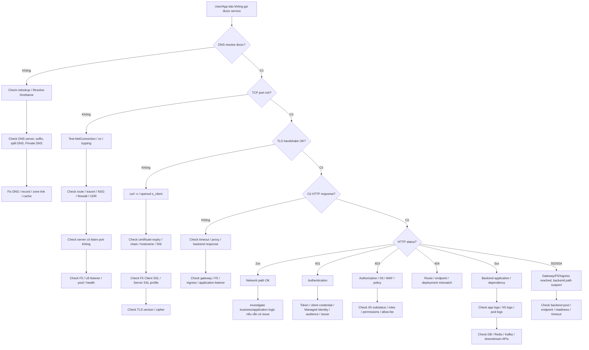

### Cách dùng

Nếu issue là:

```text
"API không gọi được"
```

đừng bắt đầu bằng code.

Đi theo đúng thứ tự:

```text
DNS
→ TCP
→ TLS
→ HTTP
→ Auth
→ Application
```

---

## 54.2 HTTPS / SSL issue

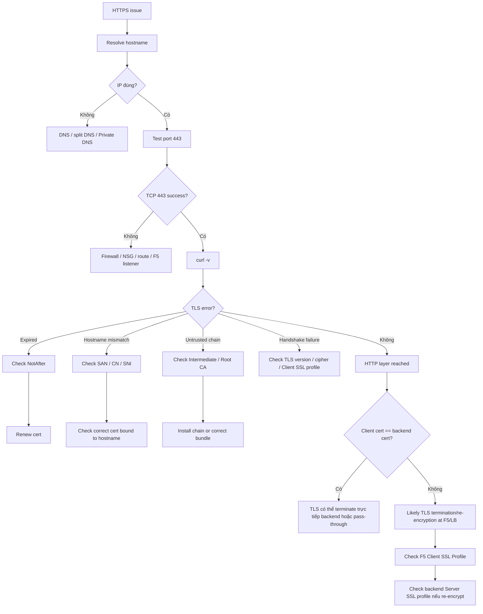

---

## 54.3 Xác định có F5 / Load Balancer hay không

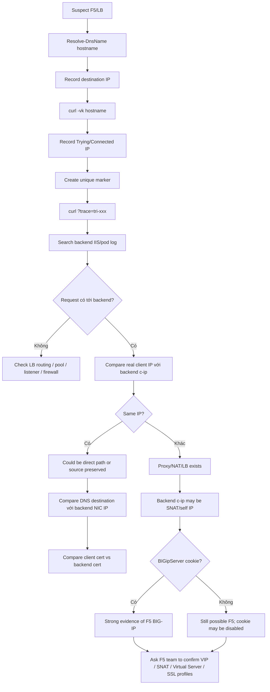

### Case Cerebro thực tế

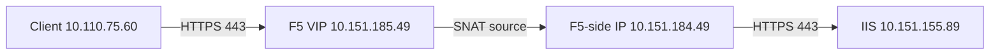

Evidence:

```text
nslookup/curl destination = 10.151.185.49
IIS s-ip                  = 10.151.155.89
IIS c-ip                  = 10.151.184.49
real client IP            = 10.110.75.60
```

---

## 54.4 IIS site issue

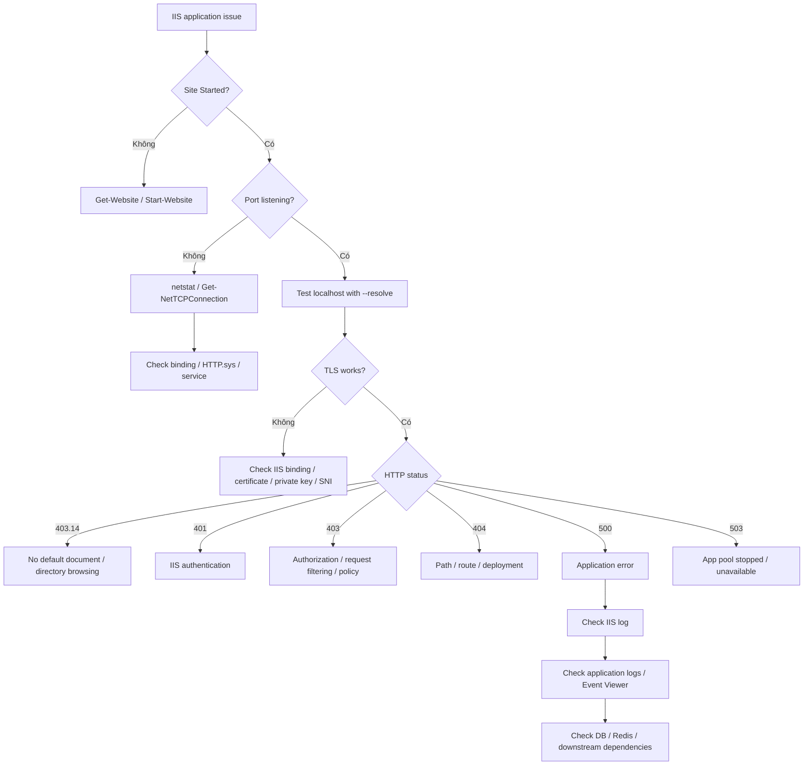

---

## 54.5 AKS pod không gọi được dependency

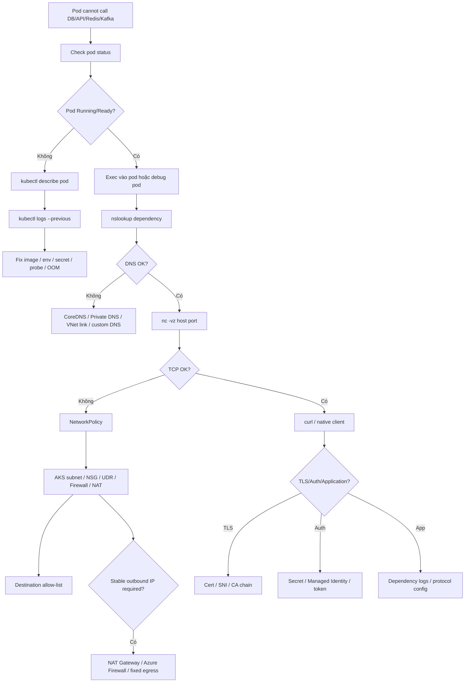

---

## 54.6 Azure VM/App Service không gọi được private resource

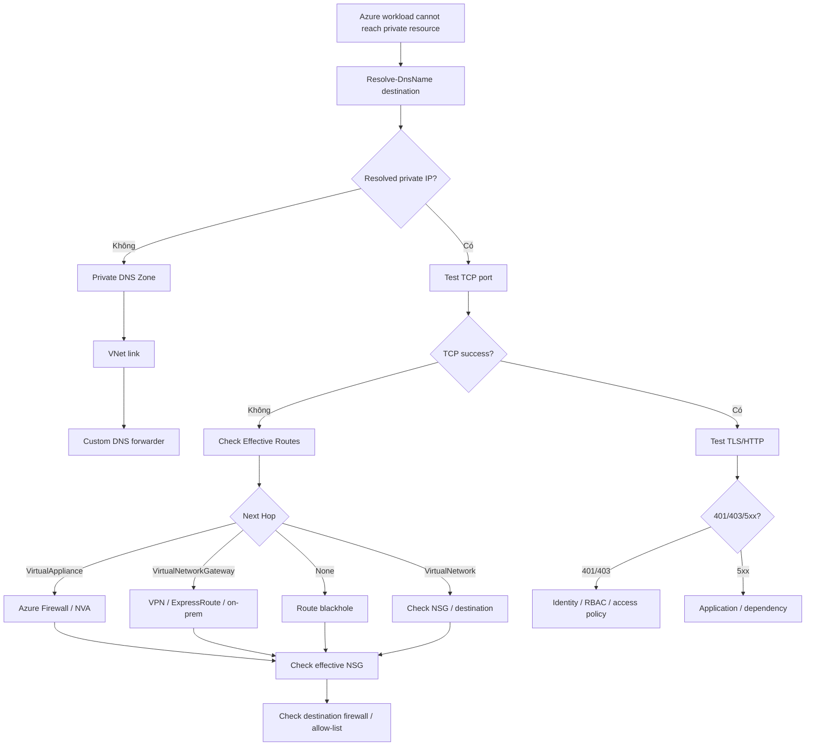

---

## 54.7 Azure DevOps self-hosted agent / AKS agent không access được internal server

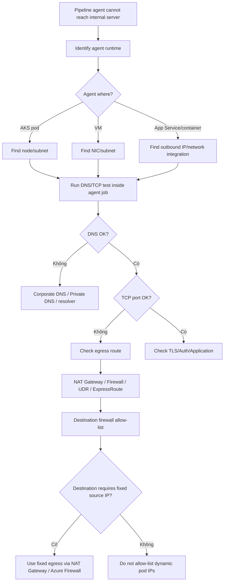

### TA note

Với AKS-hosted pipeline agent:

```text
Không nên request firewall rule theo Pod IP.
```

Pod IP có thể thay đổi.

Nên xác định:

```text
AKS subnet
→ egress path
→ NAT Gateway / Azure Firewall
→ stable source IP
```

---

## 54.8 SQL Server connectivity issue

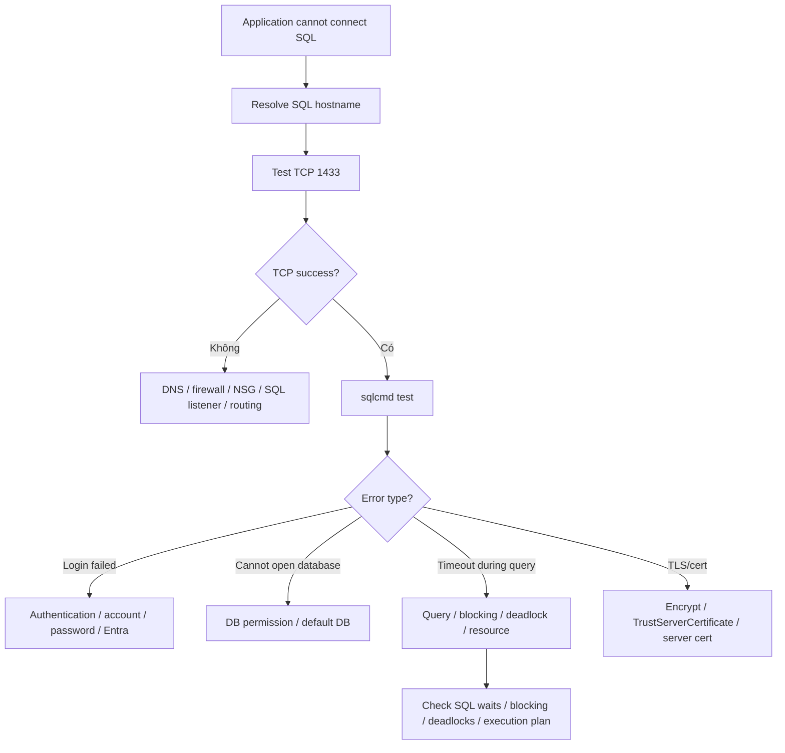

---

## 54.9 HTTP status based decision flow

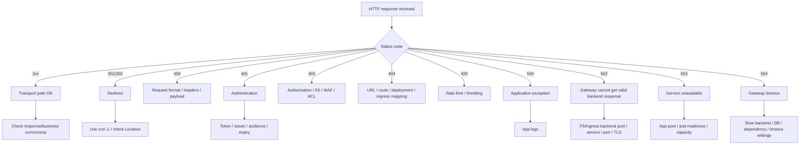

---

## 54.10 "Ai là owner?" — routing issue tới đúng team

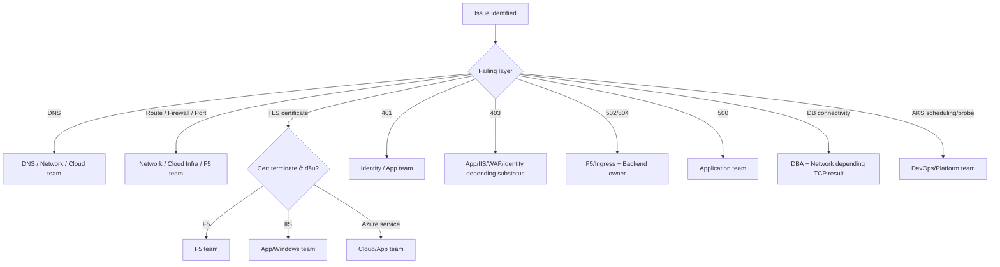

---

# 55. One-page TA Network Investigation Flow

> Nếu chỉ giữ lại **một Mermaid duy nhất**, dùng flow này.

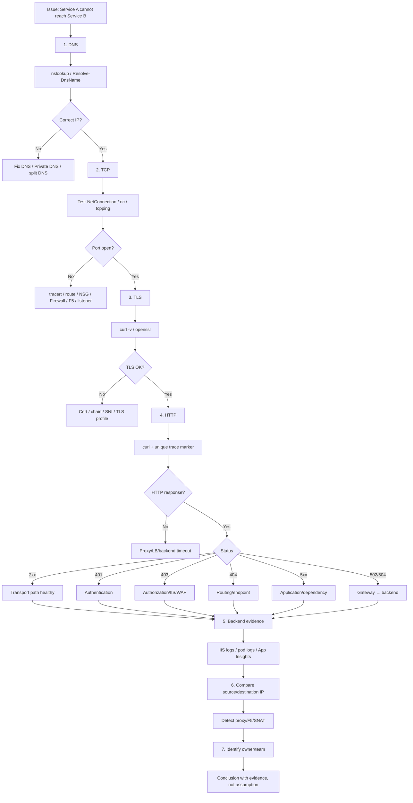

---

# 56. Mermaid usage notes

Nếu Markdown viewer không render Mermaid, vẫn có thể đọc source block bình thường.

Các nơi thường render Mermaid tốt:

```text
GitHub
GitLab
Azure DevOps Wiki (tùy cấu hình/extension)
Obsidian
VS Code Markdown Preview với Mermaid support
Notion (qua Mermaid/code integration tùy workspace)
```

Nếu tool không support Mermaid, có thể copy block vào Mermaid Live Editor hoặc VS Code extension để xem diagram.

